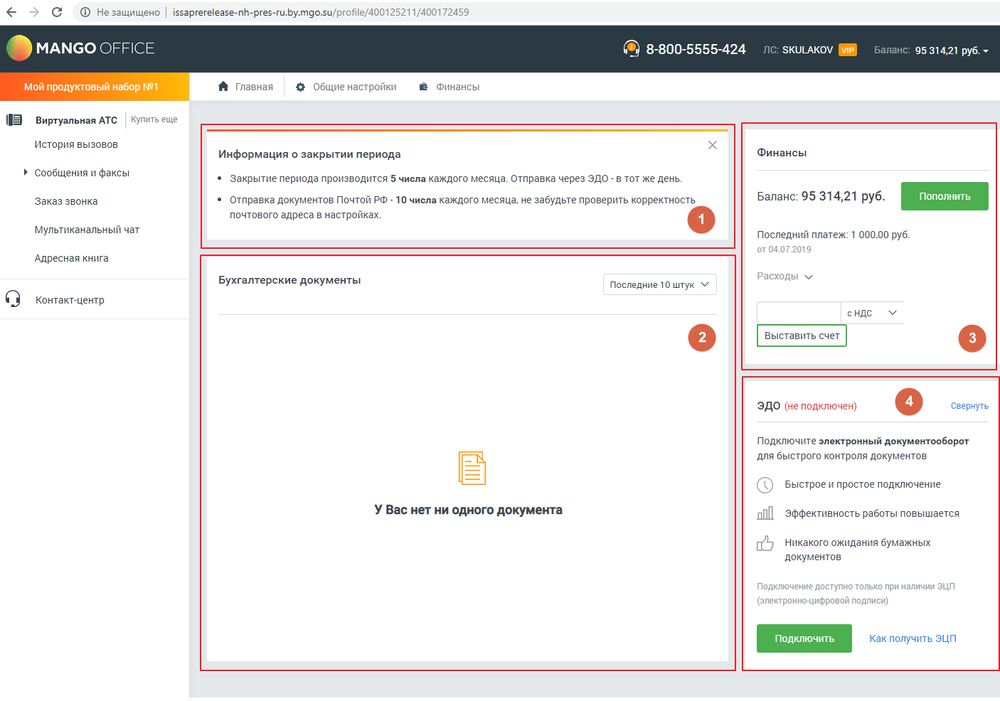

# Виджеты Бухгалтера

> Трассировка: PDF §4 · сквозные стр. 69 · источники: ч.1 `kb/mango-product-docs/sources/mango-lk-manual/LK_manual_v-121часть-1.pdf` с.69.

Пользователям с ролью Бухгалтер (и производными от этой роли) доступны следующие виджеты: 1. Информация о закрытии периода 2. Бухгалтерские документы - виджет отображает последние 10 документов, или документы за последние 30 дней, по выбору пользователя. 3. Финансы – информация о текущей сумме денежных средств на счету пользователя и последнем платеже. Также имеется поле для выставления новых счетов, с или без НДС. 4. ЭДО (электронный документооборот) - для подключения виджета нажмите кнопку Подключить и заполните данные об организации в открывшейся форме заявки. Сохраните внесенные изменения. Для подключения виджета ЭДО необходимо наличие электронной цифровой подписи (ЭЦП).
