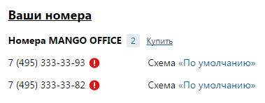

# 4.2.1. Номера MANGO OFFICE

> Трассировка: PDF §4.2.1 · сквозные стр. 75-76 · источники: ч.1 `kb/mango-product-docs/sources/mango-lk-manual/LK_manual_v-121часть-1.pdf` с.75-76.

Группа содержит информацию о многоканальных номерах (телефонных линиях) MANGO OFFICE, используемых с данной Виртуальной АТС. Одновременно отображается три номера, отсортированных по дате покупки. При нажатии на кнопку «Купить еще» на новой вкладке браузера откроется страница интернет-магазина «Манго Телеком». Напротив каждого номера отображается наименование схемы распределения звонков. При нажатии на наименование схемы осуществляется переход на страницу, содержащую настройки данной входящей линии.

Некоторые номера могут быть отмечены пиктограммой вида (см. на рисунке ниже). Это означает, что номер находится в статусе «Новый»: он был зарезервирован для использования с данным продуктом ВАТС, но еще не оплачен. Такой номер нельзя использовать для приема или совершения вызовов до его активации. Номер резервируется на пять дней с момента покупки.
