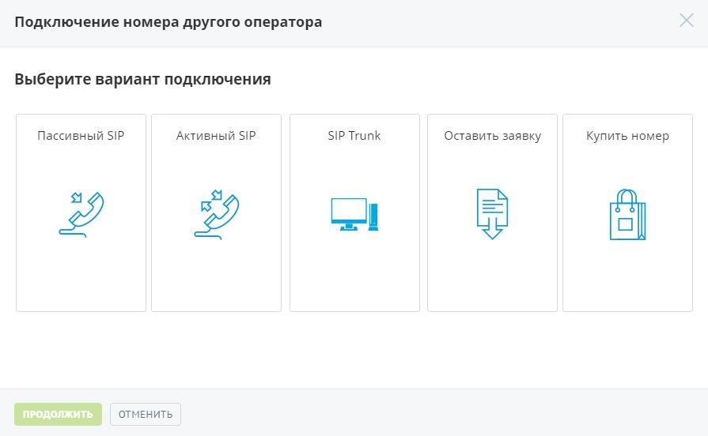

# 4.2.2. Номера других операторов

> Трассировка: PDF §4.2.2 · сквозные стр. 76 · источники: ч.1 `kb/mango-product-docs/sources/mango-lk-manual/LK_manual_v-121часть-1.pdf` с.76.

Эта группа отображает информацию о номерах других операторов, используемых с данной Виртуальной АТС. С помощью Виртуальной АТС можно создать свой поддомен SIP. Это позволит добавлять в него учетные записи пользователей SIP. Для подключения номера другого оператора нажмите кнопку Подключить. Выберите режим работы номера другого оператора и нажмите Продолжить.

Также вы можете оставить заявку на подключение номера стороннего оператора нашему сотруднику, который свяжется с вами для обсуждения условий подключения. Если вы не хотите настраивать и подключать номер самостоятельно, воспользуйтесь предложением покупки номера. Для этого укажите вариант «Купить номер» и на странице официального сайта «Манго-Телеком» выберите один или несколько многоканальных номеров.
