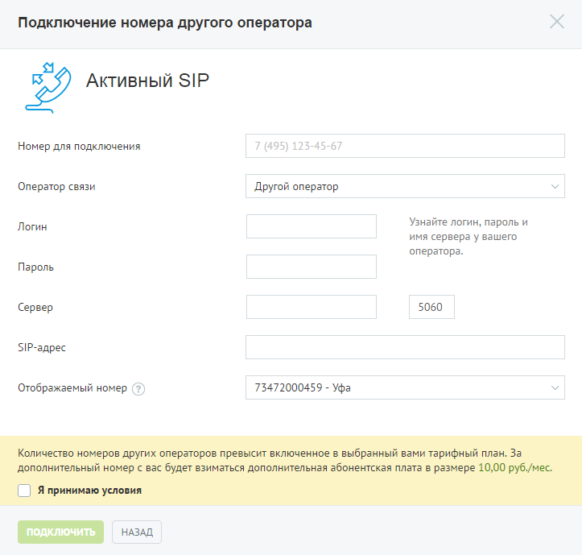
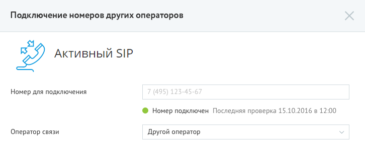

# 4.2.2.2. Активный SIP

> Трассировка: PDF §4.2.2.2 · сквозные стр. 78-79 · источники: ч.1 `kb/mango-product-docs/sources/mango-lk-manual/LK_manual_v-121часть-1.pdf` с.78-79.

При выборе активного режима звонки принимаются через активную SIP-учетку стороннего оператора. Доступны входящие и исходящие вызовы.

Введите необходимые данные в поле «Номер для подключения». Выберите оператора связи из выпадающего списка. В зависимости от выбора оператора отображается набор дополнительных полей для ввода данных учетной записи. Укажите данные – логин и пароль, при необходимости также следует указать адрес сервера и SIP-адрес. В случае, если поле «SIP-адрес» не отображается, то SIP-адрес формируется автоматически. В поле «Отображаемый номер» указывается линия, по которой будут маршрутизироваться входящие звонки на SIP-линию при переадресации. Ознакомьтесь с условиями и установите флаг «Я принимаю условия». Для завершения создания номера другого оператора нажмите Подключить. Сообщите вашему оператору новый SIP-адрес. После создания номера другого оператора информация в блоке «Номера других операторов» автоматически обновляется. Нажмите на номер другого оператора, если хотите изменить его. Для удобства использования подключений внешних линий в активном режиме предусмотрен функционал информирования о статусе подключения. Соответствующий

статус подключения отображается при редактировании номера под полем «Номер для подключения»:

Удаление номера осуществляется на странице «Номера, подключенные к АТС».
