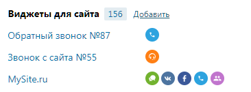

# 4.2.3. Виджеты для сайта

> Трассировка: PDF §4.2.3 · сквозные стр. 79 · источники: ч.1 `kb/mango-product-docs/sources/mango-lk-manual/LK_manual_v-121часть-1.pdf` с.79.

В этой группе приведена информация о настроенных для текущей Виртуальной АТС виджетах. Инструмент позволяет установить на сайте виджет, с помощью которого посетители этого сайта могут позвонить прямо из браузера либо заказать звонок на определенное время.

При щелчке по названию виджета отображается форма для его настройки. Напротив названия расположен список каналов виджета. При наведении курсора на канал отображается дополнительная информация.
