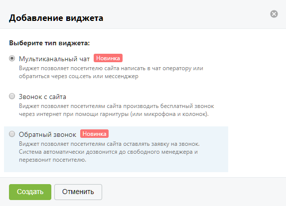

# 4.2.3.1. Добавление виджета

> Трассировка: PDF §4.2.3.1 · сквозные стр. 79-80 · источники: ч.1 `kb/mango-product-docs/sources/mango-lk-manual/LK_manual_v-121часть-1.pdf` с.79-80.

Нажмите Добавить, чтобы добавить новый виджет. При добавлении первого виджета на экране отображается форма с описанием услуги, а также возможностью просмотра обучающего видео по подключению и настройке виджета. Для продолжения нажмите Создать. Выберите тип виджета. Предусмотрены следующие типы (см. рис. на следующей странице):

• Текстовые коммуникации – при выборе этого виджета осуществляется переадресация на страницу «Текстовые коммуникации» ; • Звонок с сайта – виджет, позволяющий посетителям сайта выполнить бесплатный звонок через интернет; • Обратный звонок – виджет, позволяющий посетителям сайта оставлять запросы на обратный звонок. После выбора типа виджета ознакомьтесь с условиями подключения дополнительной услуги. После ознакомления установите флаг «Я принимаю условия подключения» и нажмите Создать для перехода к настройке виджета.

