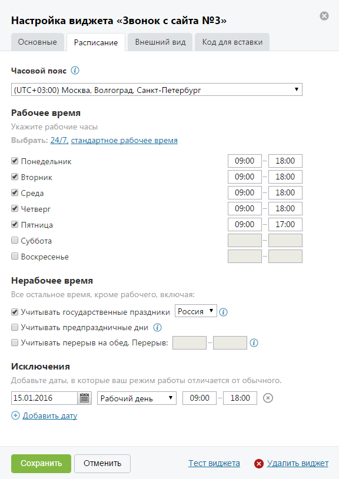

# 4.2.3.2.2. Вкладка «Расписание»

> Трассировка: PDF §4.2.3.2.2 · сквозные стр. 81-83 · источники: ч.1 `kb/mango-product-docs/sources/mango-lk-manual/LK_manual_v-121часть-1.pdf` с.81-83.

Вид вкладки представлен на рисунке на следующей странице. В зависимости от того, в какое время – рабочее или нерабочее – звонит посетитель сайта, вид и функционал виджета различаются. Данная вкладка предназначена для гибкой настройки расписания.

Часовой пояс Из выпадающего списка следует выбрать часовой пояс, соответствующий часовому поясу сотрудника ВАТС. По умолчанию часовой пояс указывается согласно системному времени, установленному на устройстве пользователя. В дальнейшем правильная настройка часового пояса необходима для синхронизации времени между сотрудниками ВАТС и посетителями сайта, которые находятся в других часовых поясах. Рабочее время В данном блоке следует указать дни и часы, которые будут считаться рабочими. Для упрощения настройки расписания предусмотрены шаблоны «24/7» и «стандартное рабочее время»: • 24/7 – рабочими считаются все дни недели с 00.00 до 23.59 • стандартное рабочее время – рабочими считаются будние дни с 9.00 до 18.00, в пятницу – с 9.00 до 17.00.

Нерабочее время Всё остальное время, не указанное в предыдущем блоке, считается нерабочим. Также вы можете указать, учитывать ли в расписании: • государственные праздники страны; • предпраздничные дни; • перерыв на обед. Исключения В данном блоке указываются определенные дни-исключения, расписание которых отличается от обычного еженедельного расписания. Дни исключения с пустыми датами при сохранении виджета удаляются.
