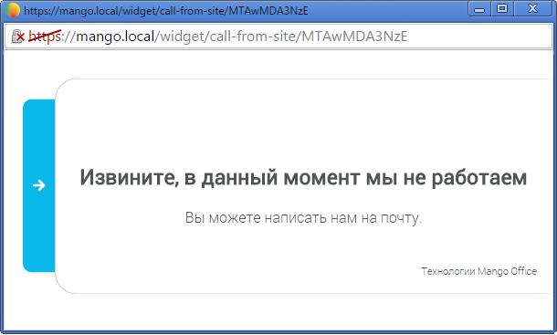

# 4.2.3.2.5. Тест виджета

> Трассировка: PDF §4.2.3.2.5 · сквозные стр. 86-87 · источники: ч.1 `kb/mango-product-docs/sources/mango-lk-manual/LK_manual_v-121часть-1.pdf` с.86-87.

На каждой вкладке расположена ссылка «Тест виджета». Она используется для тестирования виджета согласно установленному расписанию и настройкам внешнего вида. При нажатии ссылки виджет открывается в отдельном окне браузера. Нажмите на кнопку или ярлык для отображения виджета.

