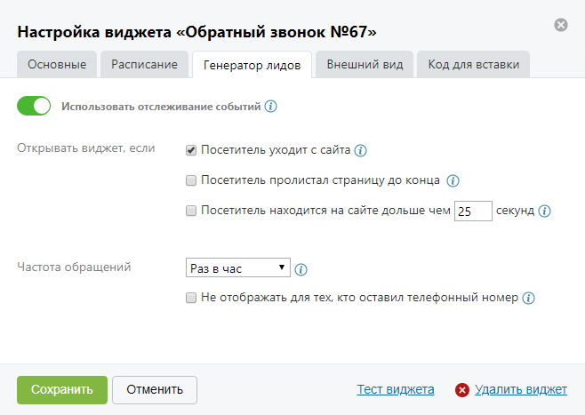

# 4.2.3.3.3. Вкладка «Генератор лидов»

> Трассировка: PDF §4.2.3.3.3 · сквозные стр. 90-91 · источники: ч.1 `kb/mango-product-docs/sources/mango-lk-manual/LK_manual_v-121часть-1.pdf` с.90-91.

Внимание Функционирование генератора лидов доступно только при автоматическом режиме работы виджета. На данной вкладке осуществляется настройка отслеживания событий. Данная услуга позволяет отобразить виджет при определенных действиях посетителя сайта.

Предусмотрены следующие настройки лидогенерации: • Открывать виджет, если – выбор отслеживаемых действий посетителя; • Частота обращений – период, через который виджет отображается повторно. Для сохранения настроек нажмите Сохранить.
