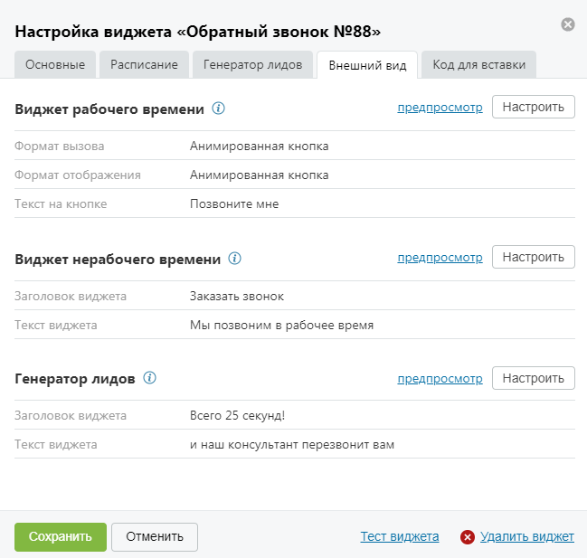
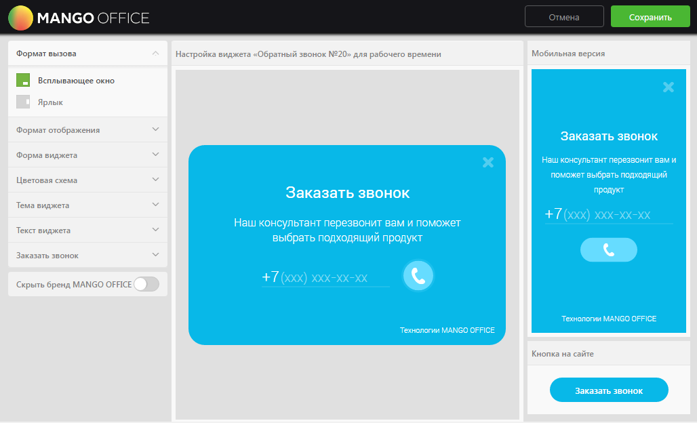
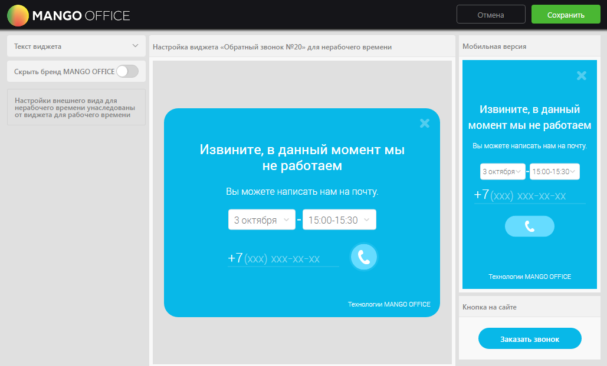

# 4.2.3.3.4. Вкладка «Внешний вид»

> Трассировка: PDF §4.2.3.3.4 · сквозные стр. 91-96 · источники: ч.1 `kb/mango-product-docs/sources/mango-lk-manual/LK_manual_v-121часть-1.pdf` с.91-96.

На данной вкладке указаны основные элементы настройки внешнего вида для виджетов рабочего и нерабочего времени, а также виджета генератора лидов. Вид вкладки представлен на рисунке ниже.

Для предпросмотра внешнего вида настроенного виджета нажмите «предпросмотр» в блоке соответствующего виджета. В результате в новом окне браузера отображается виджет для рабочего/нерабочего времени соответственно. Для настройки внешнего вида нажмите Настроить в блоке соответствующего виджета. Настройка осуществляется в отдельной форме «Настройка внешнего вида виджета для рабочего времени» или «Настройка внешнего вида виджета для нерабочего времени» соответственно. Виджет рабочего времени Вид формы для настройки виджета для рабочего времени представлен на рисунке на следующей странице.

Для настройки используйте набор переключателей в левой области формы. Изменения внешнего вида виджета отображаются в режиме реального времени в центральной области формы. В правой области отображается внешний вид кнопки в том виде, в котором она будет отображаться на сайте. Набор переключателей содержит следующие элементы: Формат вызова • Всплывающее окно – виджет реализован в виде всплывающего окна, вызывается нажатием кнопки/ссылки. • Ярлык – виджет вызывается нажатием на вертикальный ярлык. Формат отображения • Всплывающее окно – виджет реализован в виде всплывающего окна; • Сбоку экрана – виджет будет размещен сбоку экрана. Местоположение • Слева – виджет будет отображаться с левого бока экрана; • Справа – виджет будет отображаться с правого бока экрана; Форма виджета • Квадратная – прямые углы виджета/кнопки/ярлыка; • Закругленная – закругленные углы виджета/кнопки/ярлыка;

• Фигурная – фигурная граница формы виджета; Цветовая схема • Основной цвет – выбор цвета основной области виджета/кнопки/ярлыка; • Дополнительный цвет – выбор цвета дополнительных элементов виджета. Тема виджета • Без темы – переключатель для включения/выключения темы оформления виджета. Текст виджета • Заголовок – текст заголовка виджета; • Текст виджета – основной текст виджета. Заказать звонок • Текст на кнопке/ярлыке – текст, который будет указан на кнопке/ярлыке. Скрыть бренд MANGO OFFICE • Скрыть бренд MANGO OFFICE – включение/выключение отображения бренда компании на виджете. Сохранение настроек выполняется после нажатия кнопки Сохранить. При этом форма настройки внешнего вида закрывается и осуществляется возврат к вкладке «Внешний вид». Виджет нерабочего времени Настройки внешнего вида виджета для нерабочего времени унаследованы от виджета для рабочего времени. Вид формы для настройки виджета для нерабочего времени представлен на рисунке на следующей странице.

Набор переключателей содержит следующие элементы: Текст виджета • Заголовок – текст, который отображается в заголовке виджета; • Текст виджета – дополнительный текст с меньшим размером шрифта. Скрыть бренд MANGO OFFICE • Скрыть бренд MANGO OFFICE – включение/выключение отображения бренда компании на виджете. Посетитель сайта сможет выбрать получасовой промежуток для обратного звонка согласно вашим настройкам расписания рабочего времени. Предлагаемый период для выбора времени – три рабочих дня, начиная с текущего, если для него остались рабочие часы. Если для текущей даты рабочего времени не осталось, то виджет предлагает выбрать время в следующий рабочий день согласно расписанию, а также в два последующих за ним дня. При установке соответствующих флагов на закладке «Расписание» учитывается расписание праздничных и предпраздничных дней, перерывов и исключений. Пример. Рабочее время установлено с 9:00 до 18:00, обеденный перерыв – с 12:00 до 13:00. Вариант 1. При просмотре виджета до 9:00 посетителю будут предложено время для обратного звонка в промежутки 9:00-9:30, 9:30-10:00 и так далее до конца рабочего дня за исключением обеденного времени.

Вариант 2. При просмотре виджета в период с 12:00 до 13:00 посетителю будут предложено время для обратного звонка в промежутки 13:00-13:30, 13:30-14:00 и так далее до конца рабочего дня. Вариант 3. При просмотре виджета в период после 18:00 и до 00:00 посетителю будет предложено выбрать время в следующий рабочий день согласно расписанию. Сохранение настроек выполняется после нажатия кнопки Сохранить. При этом форма настройки внешнего вида закрывается и осуществляется возврат к вкладке «Внешний вид».
