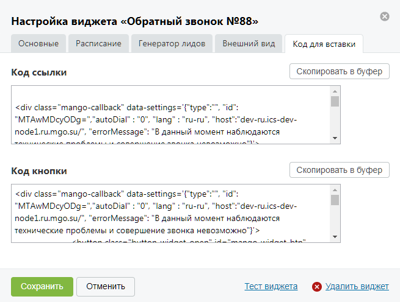

# 4.2.3.3.5. Вкладка «Код для вставки»

> Трассировка: PDF §4.2.3.3.5 · сквозные стр. 96-97 · источники: ч.1 `kb/mango-product-docs/sources/mango-lk-manual/LK_manual_v-121часть-1.pdf` с.96-97.

Поля вкладки содержат код, формируемый системой для совокупности настроек работы виджета и настроек внешнего вида виджета. Данный код используется для внедрения виджета на сайт. Набор полей зависит от формата отображения виджета. При формате отображения «Всплывающее окно» на вкладке расположены поля «Код ссылки» и «Код кнопки». Вид вкладки представлен на рисунке на следующей странице.

При формате отображения «Ярлык» на вкладке расположено единственное поле «Код ярлыка». Для копирования нужного кода в буфер обмена нажмите кнопку Скопировать в буфер, расположенную в соответствующем блоке.

