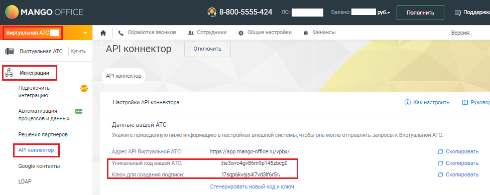

# Как узнать свой уникальный код ВАТС (vpbx_api_key) и ключ создания подписи (vpbx_api_salt)?

> Трассировка: PDF §2.3.7 · сквозные стр. 16-17 · источники: ч.1 `kb/mango-product-docs/sources/mdialogi-api/Manual_API_Mango_Dialogi.pdf` с.16-17.

подписи (vpbx_api_salt)? Чтобы узнать свои данные, в Личном кабинете MANGO OFFICE следует: 1) выберите вашу ВАТС; 2) откройте раздел "Интеграции"; 3) нажмите на пункт меню "API коннектор". На открывшейся странице в одноименных полях будут показаны уникальный код вашей ВАТС (vpbx_api_key) и ключ для создания подписи (vpbx_api_salt):

Рисунок 5 – Поля API коннектора с данными для подключения к ВАТС Манго Диалоги. Справочник по API | Версия от 27.02.2026
