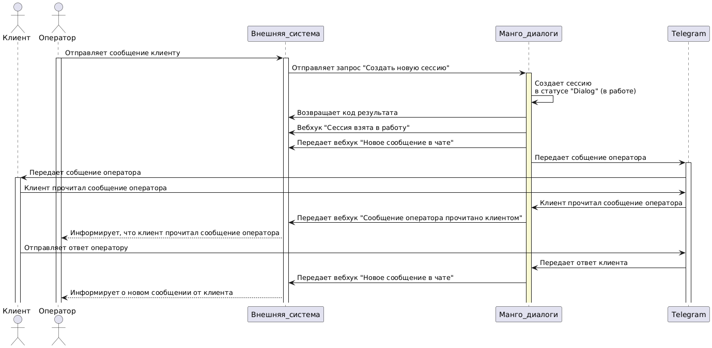

# 5.2. Оператор обращается к Клиенту

> Трассировка: PDF §5.2 · сквозные стр. 83-88 · источники: ч.1 `kb/mango-product-docs/sources/mdialogi-api/Manual_API_Mango_Dialogi.pdf` с.83-88.

Если Клиент ранее уже обращался в вашу компанию по тому или иному текстовому каналу коммуникации, то ваш оператор может обратиться к данному Клиенту. При этом, в МД будет создано новое обращение, в рамках которого будет вестись диалог Клиента с оператором. Важно! Вы можете начать диалог в Клиентом, если у вас есть уникальный идентификатор пользователя в соц. сети (social_user_id) этого Клиента, который вы получали ранее через вебхуки МД. На рисунке ниже описан процесс обращения оператора к Клиенту, указано в какой момент в МД создается обращение и как происходит диалог между оператором и Клиентом. Манго Диалоги. Справочник по API | Версия от 27.02.2026

Рисунок 7 – Диаграмма взаимодействия при инициировании диалога с Клиентом со стороны оператора 1) чтобы инициировать диалог оператора с Клиентом, от внешней системы к МД должен отправиться запрос "Создать новую сессию (/cc/md/session/create)", включающий в себя:

| { vpbx_api_key: "123qwrty", |
| --- |
| sign: "456qwerty", |
| json: { |
| "id": "fc309", |
| "channel_id": 8020, |
| "social_user_id": "x8Nt", |
| "message": "Здравствуйте!", |
| "abonent_id": 3002 |
| }} |

2) получив запрос, МД создаст новую сессию и присвоит этой сессии статус "dialog" - передана в работу оператору. Затем от МД к внешней системе будет отправлен: - результат обработки запроса с кодом 200 ОК. Пример результата:

| { "name": "OK", |
| --- |
| "status": 200, |
| "code": 1000 |
| } |

Манго Диалоги. Справочник по API | Версия от 27.02.2026 - вебхук "Сессия взята в работу (/events/cc/md/session/on_dialog)", включающий в себя:

| { vpbx_api_key: "123qwerty", |
| --- |
| sign: "456qwerty", |
| json: { |
| session: { |
| session_id: "F2ks", |
| widget: { |
| widget_id: 1757, |
| name: "Мой виджет МД", |
| enabled: true, |
| channels: [ |
| { |
| channel_id: 8020, |
| type: 2, |
| mode: "abonent", |
| abonent_id: 3002 |
| } |
| ] |
| }, |
| update_time: 1719239024880, |
| state: "dialog", |
| variables: { |
| social_user: { |
| social_user_id: "EYLc" |
| } |
| }, |
| group_id: null, |
| abonent_id: 3002, |
| chat: { |
| chat_id: "9c9c", |
| client_id: "a946" |
| } |
| }, |
| id: "6ceb" |
| } |
| } |

Манго Диалоги. Справочник по API | Версия от 27.02.2026 - вебхук "Новое сообщение в чате (/events/cc/md/session/chat/on_message/)", включающий в себя:

| { vpbx_api_key: "123qwerty", |
| --- |
| sign: "456", |
| json: { |
| id: "fac6", |
| session_id: "F2ks", |
| chat_id: "9c9c", |
| message: { |
| message_id: "4442", |
| time: 1719239024217, |
| direction: "outgoing", |
| abonent_id: "3002", |
| payload: { |
| type: "text", |
| text: "hello there" |
| } |
| } |
| } |
| } |

- вебхук "Сообщение оператора доставлено клиенту (/events/cc/md/session/on_recv_message)", включающий в себя:

| { vpbx_api_key: "123qwerty", |
| --- |
| sign: "456qwerty", |
| json: { |
| id: "b71d", |
| session_id: "F2ks", |
| social_user_id: "EYLcf", |
| message_id: "4442" |
| } |
| } |

Манго Диалоги. Справочник по API | Версия от 27.02.2026 - вебхук "Сообщение оператора прочитано клиентом (/events/cc/md/session/on_read_message)", включающий в себя:

| { vpbx_api_key: "123qwerty", |
| --- |
| sign: "456qwerty", |
| json: { |
| id: "2c05", |
| session_id: "F2ks", |
| social_user_id: "EYLc", |
| message_id: "4442" |
| } |
| } |

3) когда Клиент начнет писать ответ оператору, от МД к внешней системы отправляется вебхук "Клиент печатает (/events/cc/md/session/chat/on_typing)", включающий в себя:

| { vpbx_api_key: "123qwerty", |
| --- |
| sign: "456qwrty", |
| json: { |
| chat_id: "9c9c", |
| client_id: "a946", |
| typing: true, |
| id: "e910" |
| } |
| } |

4) когда Клиент сформирует и отправит ответ оператору, от МД к внешней системы отправится вебхук "Новое сообщение в чате (/events/cc/md/session/chat/on_message/)", включающий в себя:

| { vpbx_api_key: "123qwerty", |
| --- |
| sign: "456qwerty", |
| json: { |
| id: "48a2", |
| session_id: "F2ks", |
| chat_id: "9c9c", |
| message: { |
| message_id: "4442", |

Манго Диалоги. Справочник по API | Версия от 27.02.2026

| time: 1719240975496, |
| --- |
| direction: "incoming", |
| client_id: "a946", |
| payload: { |
| type: "text", |
| text: "привет, оператор ! " |
| } |
| } }} |

Диалог Клиента с оператором продолжается до тех пор, пока Клиент или оператор не перестанут отправлять сообщения в течении определенного в настройках МД времени или до тех пор, пока ваш оператор не закроет обращение при помощи запроса "Закрыть сессию (/cc/md/session/close)".
