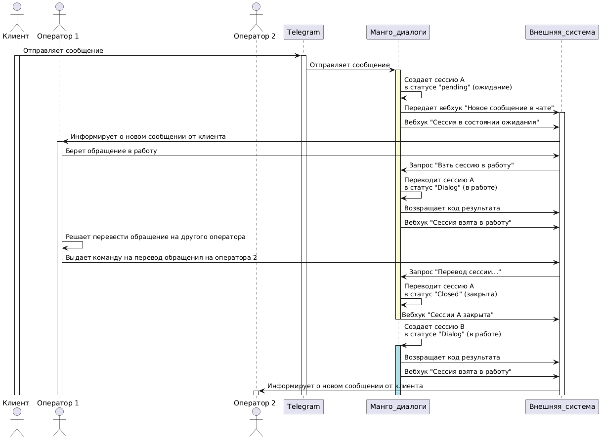

# 5.3. Перевод обращения на другого оператора

> Трассировка: PDF §5.3 · сквозные стр. 88-91 · источники: ч.1 `kb/mango-product-docs/sources/mdialogi-api/Manual_API_Mango_Dialogi.pdf` с.88-91.

В этом параграфе рассказывается о том, как перевести обработку обращения с оператора #1 на оператора #2 или группу. При переводе обращения: - закрывается обращение (сессия), назначенное на оператора #1; - открывается новое обращение (сессия), которое сразу назначается на оператора #2 или группу. Манго Диалоги. Справочник по API | Версия от 27.02.2026

Рисунок 8 – Диаграмма взаимодействия при переводе обращения на другого оператора 1) чтобы перевести обращение на другого оператора, от внешней системы к МД должен поступить запрос "Перевод сессии на другого сотрудника или группу (/cc/md/session/transfer)", включающий в себя:

| { vpbx_api_key: "123qwerty", |
| --- |
| sign: "456qwerty", |
| json: |
| { |
| "id": "fc30", |
| "session_id": "3xJn", |
| "messages": ["134252345", "345234564"], |
| "abonent_id": 3645723 |
| } |
| } |

Манго Диалоги. Справочник по API | Версия от 27.02.2026 2) получив запрос, МД выполнит: - закроет сессию, указанную в запросе; - создаст новую сессию и присвоит этой сессии статус "dialog" - передана в работу оператору. - перенесет из закрытой сессии в новую сессию массив идентификаторов сообщений, указанных в запросе. Если не указаны, будут перенесены все сообщения исходной сессии; - отправит во внешнюю систему: * вебхук "Сессия закрыта"; *вебхук "Сессия взята в работу"; * результат обработки запроса с кодом 200 ОК. Пример результата:

| { "name": "OK", |
| --- |
| "status": 200, |
| "code": 1000 |
| } |

Манго Диалоги. Справочник по API | Версия от 27.02.2026
