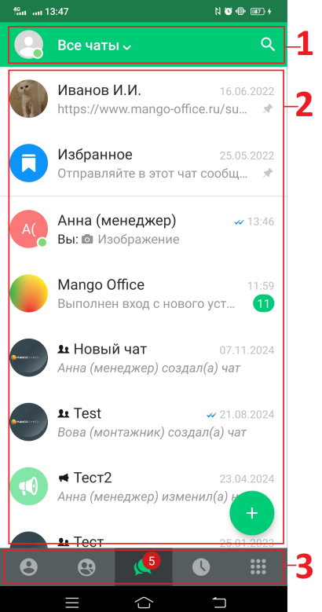

# Общее описание интерфейса

> Трассировка: PDF §— · сквозные стр. 8-9 · источники: ч.1 `kb/mango-product-docs/sources/mtalker/UserGuide_mTalker_4Mobile.pdf` с.8-9.

В окне программы отображаются следующие элементы интерфейса: 1) название активной закладки; 2) поле для отображения содержимого той или иной закладки. 3) основное меню с кнопками вызова закладок:

• - контакты;

• - конференции;

• - чаты;

• - журнал вызовов;

• - экранная клавиатура.

Mango Talker для ОС Android. Руководство пользователя | Версия от 23.08.2024
