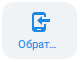

# 6.3. Заказ обратного звонка

> Трассировка: PDF §6.3 · сквозные стр. 51-52 · источники: ч.1 `kb/mango-product-docs/sources/mtalker/mTalker_User_Guide_ch1_Working.pdf` с.51-52.

Вы можете заказать обратный звонков ВАТС. В этой функции вы указываете внутренний номер сотрудника, либо мобильный номер и свой номер телефона. В результате ВАТС позвонит по указанным номерам и, когда абоненты примут вызов, установит между ними соединение. Чтобы заказать обратный звонок, в основном окне MTalker , в разделе

“Контакты” следует: 1. нажмите на строку с данными контакта, который будет участвовать в звонке. Будет открыта карточка контакта;

2. нажмите на кнопку “Обратный звонок” . Будет открыто контекстное меню; 3. выберите номер, на который хотите заказать обратный звонок: – внутренний номер; – SIP-ID; – номер мобильного телефона (отображается, если нужный вам абонент зарегистрировал свой мобильного телефона в ВАТС); Будет открыто окно “Обратный звонок”. 4. в поле “Ваш телефон” укажите ваш номер телефона (внутренний либо мобильный номер); 5. в поле “Абонент” будет указан номер контакта, выбранного вами на шаге 3; 6. нажмите кнопку “Заказать звонок”. Будет выполнен звонок на номер, указанный в поле “Ваш номер”; 7. после того, как вы примите звонок, будет выполнен звонок на номер, указанный в поле “Абонент”; 8. после того, как второй абонент пример звонок, будет установлено соединение между вами и абонентом. Примечание. Чтобы взаимодействовать с участниками , присоединившись видеоконференции, используйте встроенные инструменты MTalker. Для Mango Talker для сред ОС Windows и Mac. Руководство пользователя | Версия от 23.08.2024 управления работой своего микрофона и камеры, для демонстрации экрана или размытия вашего фонового изображения используйте настройки, описанные в разделе “Управление видео звонком”.
