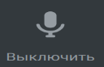
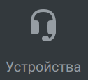
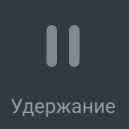

# 6.14. Во время звонка. Общее описание окна проведения сеанса связи

> Трассировка: PDF §6.14 · сквозные стр. 56-57 · источники: ч.1 `kb/mango-product-docs/sources/mtalker/mTalker_User_Guide_ch1_Working.pdf` с.56-57.

связи Во время аудио звонка, в окне проведения сеанса связи отображаются следующие инструменты, которые вы можете использовать для управления звонком:

Выключить звук. Нажав кнопку “Выключить микрофон”, звуковой сигнал с вашего микрофона больше не будет передаваться в текущий сеанс связи и ваши собеседники вас не услышат.

Клавиши. Отображение экранной клавиатуры в окне проведения сеанса связи.

Запись. Включение/выключение записи разговора. Данная функция может быть не доступна, в зависимости от настроек вашей ВАТС.

Устройства. Выбор динамиков и микрофона, которые вы будете использовать во время звонка.

Перевод. Перевод вызова на того или иного абонента, записанного в телефонной книге.

Переключить. Переключение звонка между вашими устройствами, на которых выполнен вход в ваш аккаунт MTalker.

Удержание. Удержание вызова

Еще. Кнопка для перехода к дополнительным действиям по звонкам: • Новый вызов. Совершение исходящего вызова по второй линии. При этом, текущий сеанс будет поставлен на удержание. • Отправить сообщение. Создать чат “Один-на-один”. Данная функция доступна только, если абонент записан в телефонную книгу. С помощью него вы можете отправить смс-сообщение или факс собеседнику. • Добавить участников в разговор. Добавление собеседников для проведения группового звонка. При этом все участник получают возможность слышать и разговаривать друг с другом.

Завершение вызова. Нажав кнопку “Положить трубку”, вы завершите свое участие в данном сеансе связи. При этом, если вы принимали участие в Mango Talker для сред ОС Windows и Mac. Руководство пользователя | Версия от 23.08.2024 групповом вызове, то сеанс связи будет завершен только для вас. Остальные участники продолжат сеанс связи.
