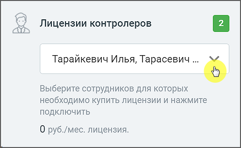

# 1.2. Как добавить контролера

> Трассировка: PDF §1.2 · сквозные стр. 5-6 · источники: ч.1 `kb/mango-product-docs/sources/quality-managment/QM_manual_v-1.26.18.pdf` с.5-6.

Контролёр – сотрудник ВАТС, оценивающий качество работы операторов по данным аналитической отчетности. Контролером может быть назначен любой сотрудник ВАТС. В задачу контролера входит работа с бланками оценки: создание бланков, оценка по бланкам, просмотр бланков.

Чтобы настроить перечень контролеров в блоке Оценка разговоров по бланкам в выпадающем списке установите галочки в чекбоксах выбранных сотрудников и ознакомьтесь со стоимостью подключения. Сохраните внесенные изменения.

