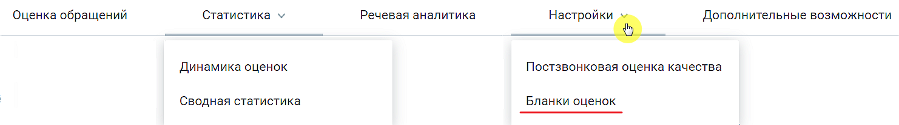

# 2. Настройка бланков оценки

> Трассировка: PDF §2 · сквозные стр. 9 · источники: ч.1 `kb/mango-product-docs/sources/quality-managment/QM_manual_v-1.26.18.pdf` с.9.

Бланки оценок предназначены для оценки работы сотрудника контролером, по совокупности критериев. Рабочая область вкладки содержит список всех бланков оценки (максимальное количество – 100). Параметры бланков оценки: • Название – наименование бланка оценки; • Автор – ФИО сотрудника, создавшего бланк оценки. Если сотрудник удален, то отображается "Удаленный сотрудник"; • Дата создания – дата создания бланка оценки в формате дд.мм.гггг; • Дата изменения – дата последнего изменения бланка в формате дд.мм.гггг; • Изменил – ФИО сотрудника, который последним сохранил изменения в бланке; • Количество оцененных разговоров – количество разговоров, которые были оценены по текущему бланку контролером. Клик по числу открывает разделы "Оценка звонков" или "Оценка чатов", в результатах которого отображаются разговоры, оцененные по соответствующему бланку. • Апелляция – включена/выключена. Если апелляция включена, у сотрудника имеется возможность подать апелляцию по оценкам для данного бланка тому же или другому контролеру. По умолчанию на продукте настроен бланк оценки "Базовая оценка сотрудника". Бланки оценки можно: • создавать • редактировать • удалять

| Важно: При оценке разговора можно заполнить только один бланк. Если по каким-то причинам |
| --- |
| контролер этого разговора выбирает другой бланк оценки, то при заполнении другого бланка |
| первичная оценка не сохраняется. Данные будут перезаписаны. |
