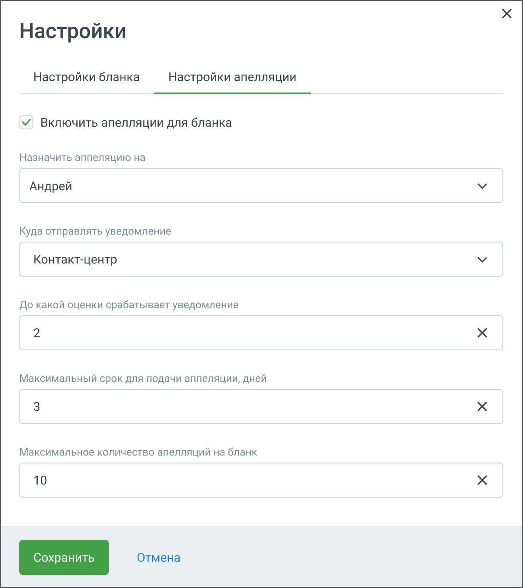

# 2.4. Настройка апелляции

> Трассировка: PDF §2.4 · сквозные стр. 13-15 · источники: ч.1 `kb/mango-product-docs/sources/quality-managment/QM_manual_v-1.26.18.pdf` с.13-15.

Для настройки оператору возможности подать апелляцию кликните по кнопке «Настроить бланк». В открывшемся окне выберите вкладку «Настройки апелляции».

Элементы настроек бланка: • Включить апелляции для бланка. Чекбокс позволяет активировать функцию апелляции для текущего бланка оценки. Если чекбокс отмечен, пользователи могут подавать апелляции на оценки, полученные по данному бланку. • Назначить апелляцию на. Выпадающее меню, позволяющее выбрать ответственного за рассмотрение апелляций. Ответственным может быть тот же или другой контролер. • Куда отправлять уведомление. Выпадающее меню для направления уведомления о поданных апелляциях. Варианты: e-mail, Контакт-центр MANGO OFFICE, • До какой оценки срабатывает уведомление. Поле для ввода минимальной оценки, при которой будет срабатывать уведомление оператору о проставленной ему оценке. Допустимое значение от 1 до 10. • Максимальный срок для подачи апелляции, дней. Поле для ввода максимального количества дней, в течение которых можно подать апелляцию после получения оценки. Допустимое значение от 1 до 30. • Максимальное количество апелляций на бланк. Поле для ввода максимального количества апелляций, которые могут быть поданы по одному бланку. Пользователь может установить лимит (например, 10 апелляций), чтобы контролировать объем обрабатываемых апелляций. Допустимое значение от 1 до 10.

• Кнопки управления: o Сохранить. После внесения всех необходимых настроек пользователь должен нажать эту кнопку, чтобы сохранить изменения. o Отмена. При нажатии на эту кнопку все изменения будут отменены, и настройки останутся без изменений.
