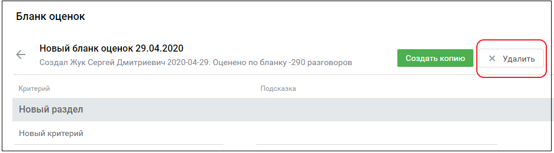

# 2.5. Удаление бланка оценки

> Трассировка: PDF §2.5 · сквозные стр. 15 · источники: ч.1 `kb/mango-product-docs/sources/quality-managment/QM_manual_v-1.26.18.pdf` с.15.

Для удаления созданного ранее бланка откройте бланк и нажмите кнопку "Удалить". Подтвердите свое согласие на удаление.

| Важно: При удалении бланка все оценки по этому бланку также удаляются. |  |
| --- | --- |

