# 3.1. Оценка звонков

> Трассировка: PDF §3.1 · сквозные стр. 17-27 · источники: ч.1 `kb/mango-product-docs/sources/quality-managment/QM_manual_v-1.26.18.pdf` с.17-27.

Отчет "Оценка звонков" содержит данные о качестве работы сотрудников ВАТС в соответствии с заданными параметрами фильтрации, и состоит из трех блоков: • Блок настройки параметров фильтрации • Блок визуализации • Блок таблицы

| Совет: В отчет "Оценка звонков" можно перейти, кликнув на число в столбце «Количество |
| --- |
| оцененных разговоров» в списке бланков оценок в разделе Настройки/Бланки оценок. В этом |
| случае в отчете уже будут проставлены соответствующие бланку параметры фильтрации. |

НАСТРОЙКА ПАРАМЕТРОВ ФИЛЬТРАЦИИ

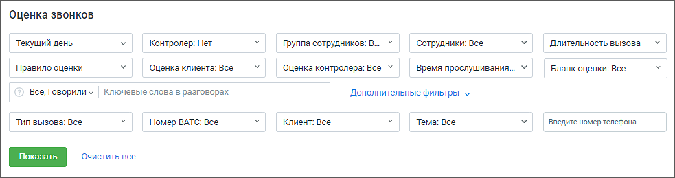

Для построения отчета воспользуйтесь следующими фильтрами (основными и дополнительными): 1. Период: • текущий день;

• последние 2 дня; • текущая неделя; • прошлая неделя; • текущий месяц; • прошлый месяц; • произвольный (протяженностью не более 3-х месяцев). При входе в модуль загружаются вызовы за текущий день. 2. Контролер – выбор из выпадающего списка доступных контролеров. 3. Группа сотрудников – при выборе групп сотрудников сформированный отчет будет включать данные только по выбранным группам. Для быстрого выбора всех групп предусмотрен элемент списка "Все группы". Также в списке имеется вариант "Без группы". 4. Сотрудники – при выборе сотрудников сформированный отчет будет включать данные только по выбранным сотрудникам. Для быстрого выбора всех сотрудников предусмотрен элемент списка "Все сотрудники". Список также включает удаленных сотрудников (если сотрудники, которые участвовали во внешних разговорах за указанный период, были удалены). 5. Длительность вызова – продолжительность звонка. • все – параметр, установленный по умолчанию; • короткие – до 30 секунд; • средние – от 30 секунд до 5 минут; • длинные – более 5 минут; • произвольная длительность в формате: от мм:сс до мм:сс; 6. Время прослушивания – время прослушивания. • все – параметр, установленный по умолчанию; • не прослушано; • прослушано меньше undefinit (где «undefinit» – время из настройки "Разговоры без прослушивания"); • прослушано больше undefinit (где «undefinit» – время из настройки "Разговоры без прослушивания"); Фильтрует вызовы, которые, соответственно, не были прослушаны (время прослушивания 0), прослушаны меньше/больше Т, где Т – время из настройки "Разговоры без прослушивания" (Например, Прослушано меньше/больше 10%). 7. Ключевые слова в разговорах – фильтр активен, если к модулю подключен блок Речевая аналитика. В настройках фильтра можно уточнить параметры поиска ключевых слов: • поиск по клиенту, сотруднику или клиенту и сотруднику • поиск по наличию либо отсутствию ключевых слов в распознанных записях разговоров (говорил/не говорил).

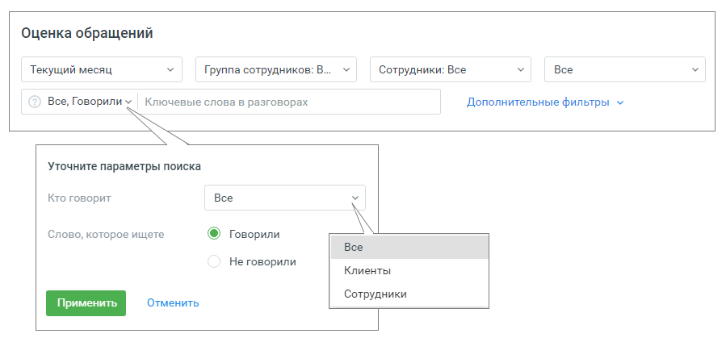

8. Тип вызова: • Все – в результатах будут показаны все внешние вызовы – входящие и исходящие, в которых принимал участие какой-либо пользователь; • Входящие – в результатах будут показаны все входящие внешние вызовы (кроме кампаний Исходящего обзвона, Заказа обратного звонка и Обратного звонка); • Исходящие – в результатах будут показаны все исходящие внешние вызовы (кроме кампаний Исходящего обзвона, Заказа обратного звонка и Обратного звонка); • Исходящий обзвон – в результатах будут показаны все вызовы в рамках кампаний Исходящий обзвон, в которых принимал участие пользователь • Обратные звонки – в результатах будут показаны все вызовы в рамках ручных и автоматических кампаний Заказа обратного звонка и Обратного звонка • Автоперезвоны – в результатах будут показаны все вызовы, выполненные системой автоматически в рамках сценариев автоперезвона. 9. Номер ВАТС – выбор номеров ВАТС (DID), по которым состоялся внешний разговор. Список содержит номера, которые ранее были подключены и на данный момент отключены. 10. Клиент – выпадающий список содержит клиентов из Адресной книги. Имеется поле для быстрого поиска клиентов. При выборе определенных клиентов сформированный отчет будет включать данные только по выбранным клиентам. Для быстрого выбора предусмотрен элемент списка "Выбрано все". 11. Темы: фильтр по тематике вызова, проставленной в Контакт-центре. Иерархия выпадающего списка: 1) Все 2) Входящие • ...(список тематик) 3) Исходящие • ...(список тематик)

4) Обратные звонки • ...(список тематик) 12. Бланк оценки – при выборе бланков оценок сформированный отчет будет включать данные только по выбранным бланкам. Для быстрого выбора предусмотрен элемент списка "Все". 13. Правило оценки – при выборе правила клиентской постзвонковой оценки сформированный отчет будет включать данные только по выбранным правилам. Для быстрого выбора предусмотрен элемент списка "Все". 14. Оценка клиента – в столбце отображается информация о постзвонковой оценке разговора клиентом. Доступны варианты: Все, 1 (Очень плохо), 2 (Плохо), 3 (Нормально), 4 (Хорошо), 5 (Отлично), Без оценки, Некорректная оценка (если оценка клиента вне диапазона 1-5). 15. Оценка контролера – в столбце отображается информация об оценке звонка контролером. Доступны варианты: Все оценки, Без оценки, Произвольные значения (от 0 до 10). По умолчанию установлено значение "Все оценки". Фильтр отображает данные с учетом веса бланка. 16. Введите номер телефона – пользователь имеет возможность отбирать разговоры в списке по номеру телефона для быстрого поиска.

| Примечание: Внутри фильтра действует принцип фильтрации – ИЛИ (когда одно из условий |
| --- |
| истинно). Между фильтрами действует принцип фильтрации – И (когда все условия истинны). |

Для формирования отчета в соответствии с заданными параметрами фильтрации нажмите на кнопку Показать. Если нажать кнопку Очистить все, состояние фильтров вернется к заданным по умолчанию. БЛОК ВИЗУАЛИЗАЦИИ Клик по кнопке Свернуть/Показать скрывает или разворачивает блок визуализации. В блоке визуализации отображаются: • Виджет сводной статистики; • Оценка – диаграмма оценок клиента или контролера; • Разговоров оценено – количество разговоров, оцененных клиентом, контролером или Речевой аналитикой в разрезе по сотрудникам; • Автоматические тематики – количество распознанных разговоров, которым были проставлены тематики, в разрезе по тематикам.

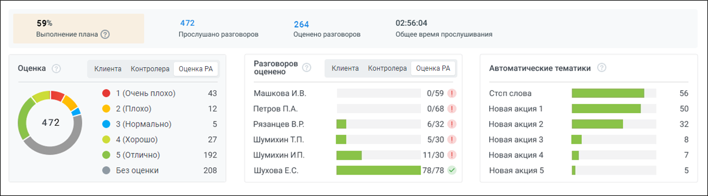

Оценка На диаграмме отображено распределение вызовов в соответствии с оценками клиента, контролера или Речевой аналитики, в зависимости от отображаемого графика.

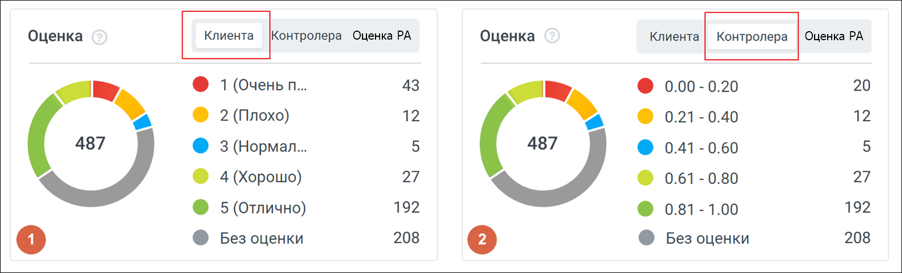

рис. 1 Оценка клиента, рис. 2 Оценка контролера Элементы диаграммы могут использоваться в качестве фильтра по оценке клиента. Для этого необходимо нажать на область определенной оценки в самой диаграмме, либо в строке соответствующей оценки. После этого в таблице и других графиках будут показаны только записи с соответствующей оценкой. Могут быть выбраны несколько оценок. При повторном нажатии на запись или область диаграммы, фильтр снимается.

| Примечание: При установке фильтра по оценке данные в таблице и других графиках обновляются |
| --- |
| автоматически. |

1. Оценка клиента Варианты оценок: • 1 (Очень плохо); • 2 (Плохо); • 3 (Нормально); • 4 (Хорошо);

• 5 (Отлично); • Без оценки; • Некорректная оценка. Для каждой оценки клиента приведено количество вызовов, которым выставлена соответствующая оценка. 2. Оценка контролера. Оценка контролера проставляется в диапазоне от 0.00 до 1: • 0.00 – 0.20; • 0.21 – 0.40; • 0.41 – 0.60; • 0.61 – 0.80; • 0.81 – 1.00. • Без оценки 3. Оценка РА Кнопка «Оценка Речевой аналитики» проставляется при условии подключенной услуги Речевая аналитика и включенного в ЛК ВАТС переключателя «Оценивать с помощью Речевой Аналитики». Путь к переключателю в ЛК ВАТС → «Безопасность и ограничения» → «Настройка доступа». Далее для конкретной роли сотрудника необходимо последовательно выбрать «Инструменты» → «Контроль качества». Для каждого диапазона оценок показано количество вызовов, которым выставлена оценка контролера. Разговоров оценено На диаграмме отображается количество разговоров, оцененных клиентом или контролером в разрезе по сотрудникам:

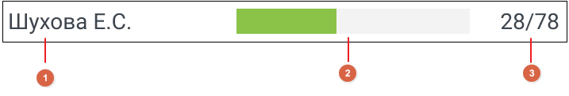

1. ФИО сотрудника 2. Шкала заполнения, которая показывает соотношение общего количества внешних вызовов данного сотрудника к вызовам, которые были оценены. 3. Информация о вызовах сотрудника, где: • первое число – количество вызовов, оцененных клиентом или контролером; • второе число – общее количество внешних вызовов сотрудника. Элементы диаграммы могут использоваться в качестве фильтра по сотруднику. Для этого необходимо нажать на строку сотрудника в самой диаграмме, после этого в таблице и других графиках будут показаны только записи по соответствующему сотруднику. Могут быть выбраны несколько сотрудников. При повторном нажатии на строку, фильтр снимается.

| Примечание: При установке данного фильтра данные в таблице и других графиках обновляются |
| --- |
| автоматически. |

Автоматические тематики На диаграмме отображается количество распознанных разговоров, которым были проставлены тематики, в разрезе по тематикам.

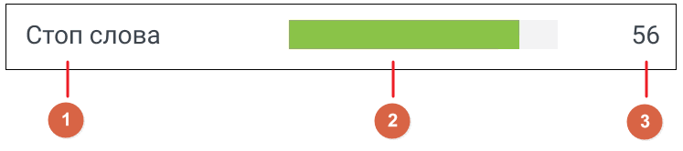

Каждая строка содержит: 1. Название тематики; 2. Шкала заполнения, которая показывает соотношение общего количества разговоров данной тематики по отношению к тематике с максимальным количеством разговоров. 3. Количество разговоров, в которых данная тематика была распознана; Элементы диаграммы могут использоваться в качестве фильтра по тематикам. Для этого необходимо нажать на строку тематики в самой диаграмме, после этого в таблице и других графиках будут показаны только записи по соответствующей тематике. Могут быть выбраны несколько тематик. При повторном нажатии на строку, фильтр снимается.

| Примечание: При установке данного фильтра данные в таблице и других графиках обновляются |
| --- |
| автоматически. |

БЛОК ТАБЛИЦЫ В блоке таблицы отображаются данные о качестве работы сотрудников ВАТС в соответствии с заданными параметрами фильтрации. По умолчанию вызовы отсортированы по дате/времени начала вызова. Таким образом, последние разговоры расположены вверху таблицы.

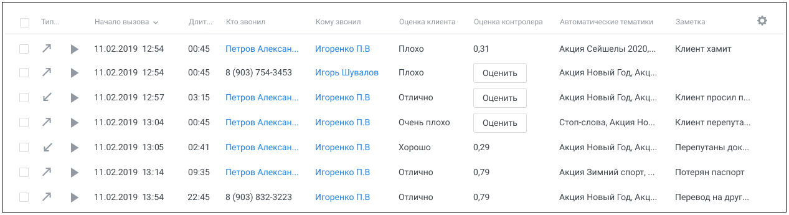

Таблица содержит фиксированные (1 – 4) и настраиваемые (5 – 20) столбцы:

1. Чекбокс для выбора записей. Этот столбец присутствует в таблице всегда. Активация общего чекбокса означает выбор всех записей на текущей странице. 2. Тип вызова – входящий, исходящий, обратный звонок, исходящий обзвон, обратные звонки. Подробнее здесь.

3. Кнопка "play" – для прослушивания записи разговора (только для записанных разговоров).

4. Кнопка "видеозапись" – для перехода к видео-записи экрана сотрудника во время диалога (если имеется). Подробнее здесь. Вы можете самостоятельно выбрать, какие столбцы из приведенных ниже будут отображаться на

панели. Для этого щелкните правой кнопкой мыши по пиктограмме и установите/снимите флаги напротив наименований столбцов. Также допускается менять порядок размещения столбцов в таблице. Для перемещения установите курсор на наименовании столбца, и, удерживая левую кнопку мыши в нажатом состоянии, перетяните столбец в другое место. 5. Автоматические тематики – список настроенных пользователем тематик Речевой аналитики. Вызов может быть помечен, как • наименование тематики, которую распознала в вызове Речевая аналитика; • "разговор не распознан" – если разговор не оценен Речевой аналитикой; • "тематики не распознаны" – если разговор распознан, но тематики не распознаны. 6. Бланк оценки – содержит название бланка, по которому разговор был оценен контролером (только для записанных разговоров). 7. Длительность вызова – содержит длительность разговора в формате мм:чч либо ммм.чч, если длительность более часа. 8. Заметка – комментарий контролера к вызову (если имеется). Введенный текст сохраняется "на лету". 9. Клиент – номер телефона или имя клиента из адресной книги. При щелчке по имени клиента открывается Карточка клиента. 10. Комментарий к вызову – содержит комментарий к вызову, проставленный в Контакт-центре (если имеется). 11. Кому звонил – данные того, кому был адресован вызов: Имя сотрудника, ФИО клиента, либо номер телефона, на который поступил вызов. При щелчке по имени клиента/сотрудника открывается Карточка клиента/сотрудника.

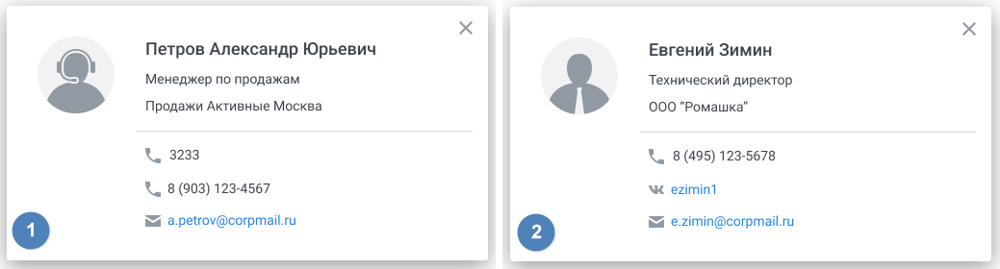

рис. 1 Карточка сотрудника, рис. 2 Карточка клиента

12. Кто звонил – данные того, кто совершил вызов: Имя сотрудника, ФИО клиента, либо номер телефона, с которого поступил вызов. При щелчке по имени клиента/сотрудника открывается Карточка клиента/сотрудника. 13. Начало вызова – дата начала вызова в формате дд.мм.гггг чч:мм:сс. 14. Оценка клиента – постзвонковая оценка качества, которую поставил клиент по завершении разговора с оператором. Варианты оценки: очень плохо, плохо, нормально, хорошо, отлично, без оценки. При наличии нескольких (не более 3-х) звуковых файлов-вопросов в выбранных Правилах постзвонковой оценки вместо столбца «Оценка клиента» в таблице отображаются столбцы «Первая оценка клиента», «Вторая оценка клиента», «Третья оценка клиента», «Средняя оценка клиента». Аналогичные данные отображаются в карточке разговора. 15. Организация клиента – наименование организации клиента из адресной книги (если имеется). 16. Сотрудник – имя сотрудника ВАТС. При щелчке по имени открывается карточка сотрудника. 17. Тема вызова – содержит тематику вызова, проставленную в Контакт-центре. Подробнее здесь. 18. Оценка контролера – оценка контролёра, в формате от 0.00 до 1, либо "Без оценки". ➢ Если оценка имеется, щелчок по кнопке Посмотреть открывает плеер с записью разговора и бланк разговора с оценками. Кнопка Посмотреть доступна всем пользователям. ➢ Если оценка отсутствует, вызов помечен кнопкой Оценить. При нажатии кнопки запускается запись разговора, и открывается список доступных контролеру бланков для проведения оценки. Кнопка Оценить доступна только для контролеров. 19. История оценок – клик по ссылке открывает окно с историей оценок выбранного диалога. Доступна информация оценок по бланку, апелляции, имя контролера, дата и время оценки, отслеживание авторства правок. 20. Оценка РА – столбец доступен, если переключатель «Оценка разговоров Речевой аналитикой» включен. В столбце отображаются оценки по критериям. Если в критерии несколько тематик – итоговая оценка является суммой оценкой по тематикам, а при наведении на оценку показываются оценки по каждой тематике. Если есть критическая ошибка, то отображается пиктограмма (!) «критическая ошибка». 21. Кнопка «Оценка Речевой аналиткики» – клик по кнопке открывает окно выбора бланка для оценки РА. Для выбора доступны только бланки с настроенными автоматическими тематиками.

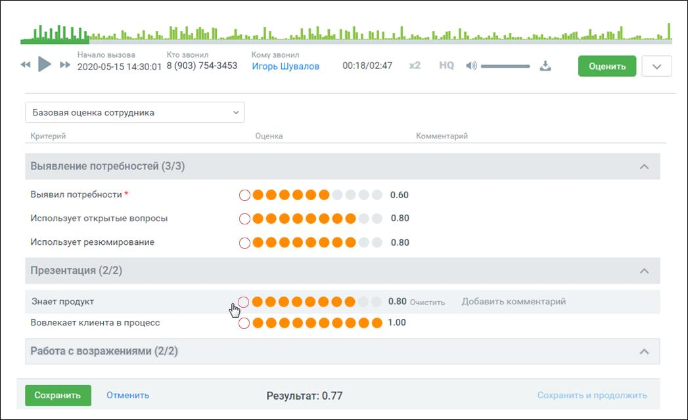

Выберите бланк из выпадающего списка, оцените работу сотрудника по совокупности критериев и сохраните введенные оценки. Клик по кнопке Очистить удаляет введенную оценку. Кнопка Добавить комментарий позволяет откомментировать критерий в процессе работы над оценкой. Клик по кнопке Отменить отменяет выставление оценки разговору и возвращает на предыдущую страницу.

Контролер может проставить критическую ошибку в бланке, чтобы иметь возможность "обнулить бланк" из-за этой ошибки, а также иметь возможно быстро отследить пиктограмму критической ошибки в списке бланков оценки и самом бланке.

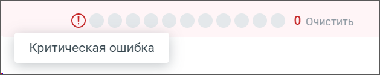

При проставлении критической ошибки выводится уведомление, информирующее пользователя о том, что при сохранении бланка все другие оценки будут удалены. Если хотя бы у одного разговора в цепочке разговоров выставлена критическая ошибка по бланку – бланк не участвует при построении графика и не отображается в Статистике.

| Совет: Если кнопка Сохранить недоступна для нажатия, проверьте – все ли критерии, помеченные |
| --- |
| * как обязательные, оценены. |

Оцененный разговор может быть переоценен по другому бланку. В этом случае действующая оценка записи обновляется, также в таблице изменяется название бланка оценки.

Предусмотрен экспорт записей разговоров в формате mp3. После клика на кнопку Скачать открывается окно, позволяющее экспортировать: • список разговоров – экспорт данных в соответствии с настройками, выбираемыми во всплывающем окне; • оценки по бланку – экспорт данных по бланку, выбираемому во всплывающем окне. Отсутствует, если среди выбранных разговоров нет ни одного с оценкой контролера; • архив с записями выбранных разговоров – формат имени аудиозаписей: "ГГГГ-ММ-ДД_ЧЧ- ММ-СС_Номер абонента_SIP Сотрудника_Номер АТС.mp3" Если к модулю подключен блок Речевая аналитика, на осциллограмме встроенного плеера

отображаются метки для ключевых слов, найденных в распознанных записях разговоров. При наведении курсора на метку всплывает подсказка, которая содержит информацию о метке.

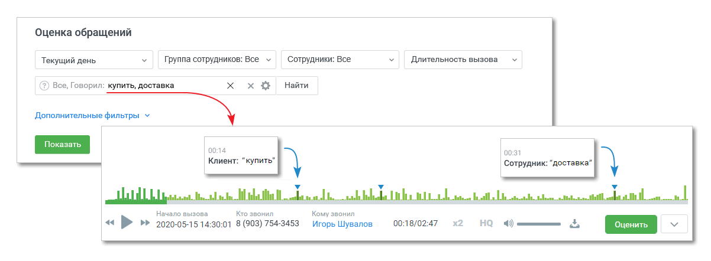
