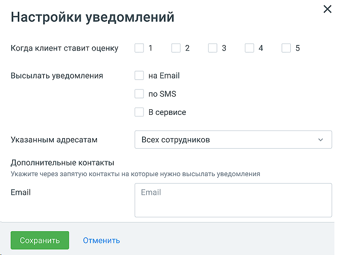
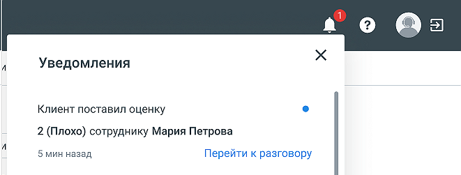

# 4.2. Настройка уведомлений о постзвонковых оценках

> Трассировка: PDF §4.2 · сквозные стр. 38-41 · источники: ч.1 `kb/mango-product-docs/sources/quality-managment/QM_manual_v-1.26.18.pdf` с.38-41.

В Личном кабинете пользователя ВАТС доступна услуга «Настройка уведомлений о постзвонковых оценках». При создании нового правила отображается кнопка Настройки уведомления.

Клик по кнопке открывает системное окно с информацией о подключении услуги.

Если в Личном кабинете пользователя ВАТС услуга «Настройка уведомлений о постзвонковых оценках» уже подключена, клик по кнопке «Настройки уведомления» открывает форму, где пользователь может задать условия отправки уведомлений:

Когда клиент ставит оценку – выбор оценок, на которые сработает правило и отправится уведомление. Поле обязательно для заполнения. Высылать уведомления – если чекбокс способа отправки проставлен, при срабатывании правила отправляется уведомление выбранным способом. Должен быть выбран хотя бы один чекбокс. Указанным адресатам – выбор адресата для отправки уведомления при срабатывании правила. Необходимо выбрать как-минимум одного сотрудника. Настройка уведомления на сотрудника- робота не доступна. Дополнительные контакты – возможность добавить произвольный e-mail (один или несколько) для дополнительного уведомления при срабатывании правила. Кнопка «Сохранить» доступна после заполнения всех обязательных полей. Клик по кнопке «Отменить» отменяет сделанный в форме изменения. Если присутствуют непрочитанные уведомления, на панели модуля «Контроль качества» отображается иконка оповещения в виде колокольчика, с цифрой количества новых уведомлений.

Клик по ссылке «Перейти к разговору» открывает страницу конкретного разговора. Если в модуле доступна услуга бланков оценки, также открывается бланк оценки.

