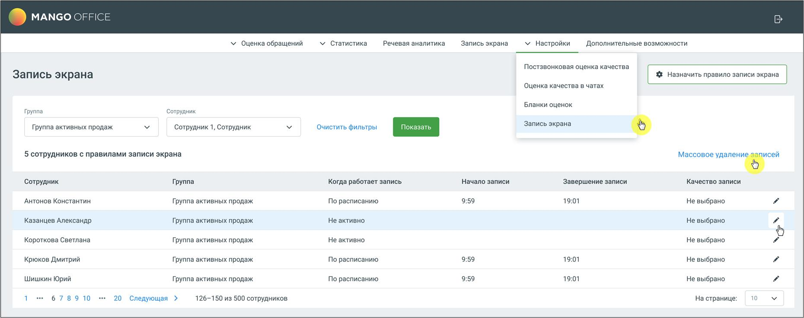

# 5.2. Просмотр настроек записи

> Трассировка: PDF §5.2 · сквозные стр. 43-45 · источники: ч.1 `kb/mango-product-docs/sources/quality-managment/QM_manual_v-1.26.18.pdf` с.43-45.

Это окно предоставляет возможность управления правилами записи экрана для сотрудников компании. Здесь можно назначать, редактировать и просматривать текущие настройки записи для отдельных сотрудников или групп.

Элементы окна и их функционал: 1. Фильтры поиска: • Группа: Выпадающий список для выбора группы сотрудников, настройки записи экрана которых нужно просмотреть или изменить. • Сотрудник: Выпадающий список для выбора конкретного сотрудника из выбранной группы. • Очистить фильтры: Кнопка для сброса всех фильтров к исходным значениям. • Показать: Кнопка для применения выбранных фильтров и отображения соответствующих результатов. 2. Кнопка "Массовое удаление записей" – кнопка предназначена для быстрого удаления файлов записей экранов за указанный период времени. Позволяет освободить место в облачном хранилище и поддерживать актуальность данных, исключая необходимость ручного удаления записей по одной. После подтверждения система удаляет файлы записей экранов за указанный диапазон дат. 3. Список сотрудников с правилами записи экрана: • Сотрудник: Имя сотрудника, для которого настроено правило записи экрана. • Группа: Группа, к которой принадлежит сотрудник. • Когда работает запись: Статус активности правила записи экран. Варианты: "По расписанию", "Не активно". • Начало записи: Время начала записи экрана (если установлено) • Завершение записи: Время завершения записи экрана (если установлено). • Качество записи: Установленное качество записи экрана для конкретного сотрудника. Варианты: Низкое, Среднее, Высокое, Наивысшее. 4. Назначить правило записи экрана:

• Кнопка "Назначить правило записи экрана" открывает окно для создания нового правила записи экрана. 5. Редактирование правила записи: • Клик по иконке "карандаш" в строке каждого правила позволяет редактировать существующее правило записи экрана для данного сотрудника. • Из окна редактирования доступно удаление правила записи экрана. Для удаления нажмите кнопку Удалить расписание. В открывшемся окне подтвердите выполнения действия.
