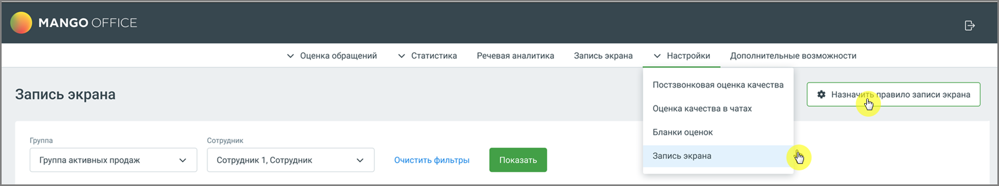
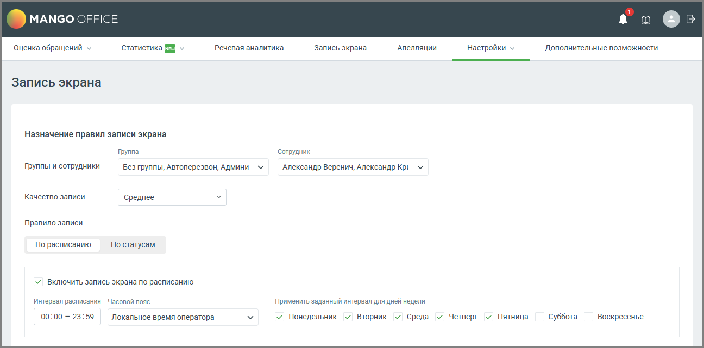

# 5.3. Назначение правил записи

> Трассировка: PDF §5.3 · сквозные стр. 45-48 · источники: ч.1 `kb/mango-product-docs/sources/quality-managment/QM_manual_v-1.26.18.pdf` с.45-48.

Администратор может настроить расписание для нескольких сотрудников таким образом, чтобы запись экрана работала в определенный интервал времени Для настройки расписания пройдите в раздел Настройки → Запись экрана и нажмите на кнопку «Назначить правило записи экрана».

Настройки включают выбор группы сотрудников, качество записи, а также расписание записи экрана.

Элементы окна настроек и их функционал: 1. Группы и сотрудники: • Группа: Выпадающий список, позволяющий выбрать группу сотрудников, к которой будет применяться правило записи экрана. • Сотрудник: Выпадающий список для выбора конкретного сотрудника из выбранной группы, для которого будет применяться правило. На одного сотрудника можно создать только одно правило записи экрана. 2. Качество записи: • Выпадающий список для выбора качества записи экрана. Доступные варианты: Низкое, Среднее, Высокое, Наивысшее.

| Качество видео | Исходящий трафик (час, Объем данных за 1 час записи экрана | Исходящий трафик (8-часовая смена) | Исходящий трафик (12-часовая смена) | Интернет-канал под функционал |
| --- | --- | --- | --- | --- |
| Низкое (h264, framerate = 1, crf = 51) | 71,2 Mb | 570 Mb | 855 Mb | 0,16 Мбит/s |
| Среднее (h264, framerate = 4, crf = 43) | 151,8 Mb | 1214 Mb | 1822 Mb | 0,34 Мбит/s |
| Высокое (h264, framerate = 7, crf = 37) | 588,46 Mb | 4708 Mb | 7062 Mb | 1,3 Мбит/s |

| Качество видео | Исходящий трафик (час, Объем данных за 1 час записи экрана | Исходящий трафик (8-часовая смена) | Исходящий трафик (12-часовая смена) | Интернет-канал под функционал |
| --- | --- | --- | --- | --- |
| Наивысшее (h264, framerate = 10, crf = 30) | 1548,4 Mb | 13387,2 Mb | 18580,8 Mb | 3,44 Мбит/s |

* framerate - кадровая частота, crf - режим кодирования для кодеков x264 и x265 с постоянным воспринимаемым качеством

| Совет: Стандартный плеер Windows не поддерживает кодек, используемый для записи экрана. Для |
| --- |
| корректного воспроизведения рекомендуется использовать медиаплеер VLC, который |
| обеспечивает поддержку большинства форматов и кодеков без необходимости установки |
| дополнительных компонентов. |

3. Переключатель «Правило записи» Определяет, по какому принципу система будет запускать запись экрана для выбранных сотрудников или групп. Доступные варианты: • По расписанию — запись экрана активируется автоматически в заданные дни недели и временные интервалы. • Указывается время начала и окончания записи. • Можно выбрать часовой пояс (локальное время оператора или системное). • Допускается применение расписания к определённым дням недели. • По статусам — запись экрана запускается при переходе сотрудника в выбранные статусы. • Можно отметить стандартные статусы (На линии, Перерыв, Обзвон и др.) или пользовательские. • При изменении статуса на один из отмеченных — запись экрана запускается автоматически. 4. Кнопка «Сохранить» сохраняет внесенные изменения. 5. Кнопка «Отменить» отменяет внесенные изменения и возвращает пользователя в окно списка правил записи для сотрудников. При нехватке места в хранилище сохранение записей останавливается. Пользователю отправляется push-уведомление с рекомендацией освободить место.

