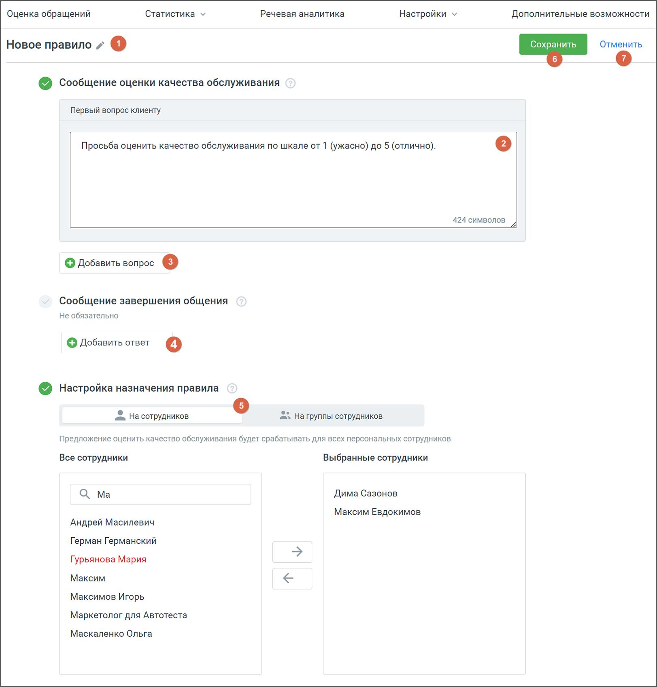

# 6.1. Создание, редактирование и удаление правила

> Трассировка: PDF §6.1 · сквозные стр. 48-51 · источники: ч.1 `kb/mango-product-docs/sources/quality-managment/QM_manual_v-1.26.18.pdf` с.48-51.

Чтобы создать новое правило оценки нажмите на кнопку «Добавить правило».

В открывшемся окне заполните необходимые поля: 1) Название – наименование правила оценки. Клик по пиктограмме «карандаш» позволяет редактировать наименование;

2) Сообщение оценки качества обслуживания – поле, где необходимо вписать вопрос клиенту. Текст вопроса будет показан клиенту после завершения диалога с сотрудником и закрытии обращения. Максимальная длина сообщения – 500 символов; 3) Кнопка «Добавить вопрос» – клик по кнопке открывает новое поле для вопроса клиенту. Всего можно добавить не более трех вопросов. Для подсчета оценки берется среднее значение по всем вопросам. 4) Сообщение завершения общения – клик по кнопке «Добавить вопрос» открывает новое поле для сообщения клиенту. Сообщение будет показано, когда клиент поставит оценку на заданные ранее вопросы. Поле не обязательно для заполнения. 5) Настройка назначения правила – сотрудники или группы, которым назначается данное правило. Вопросы, содержащиеся в правиле, будут заданы клиенту после завершения разговора с указанными сотрудниками или группами. Если сотрудник или группа назначены на другое правило оценки, в списке они выделены красным цветом. При попытке назначить такого сотрудника или группу на новое правило, открывается соответствующее системное уведомление; 6) Кнопка «Сохранить» – клик по кнопке сохраняет внесенные в бланк изменения 7) Кнопка «Отменить» – клик по кнопке отменяет внесенные изменения, и возвращает пользователя к списку правил на рабочей области вкладки. Чтобы отредактировать правило, кликните на наименование правила в списке правил на рабочей области вкладки. Внесите необходимые изменения и сохраните кнопкой «Сохранить».

| Важно: После получения хотя бы одной оценки клиента по данному правилу вопросы правила |
| --- |
| недоступны для редактирования. |

Чтобы удалить правило, откройте его в режиме редактирования и нажмите кнопку «Удалить» в правом верхнем углу экрана. Подтвердите согласие на удаление. При отключении услуги «Омниканальная оценка диалогов» удаляются и созданные по ней правила. Если в настройках омниканальной оценки диалогов был отмечен чекбокс «Несколько вопросов», а затем чекбокс был отключен, то правила, в которых есть несколько вопросов, будут содержать первый вопрос.

