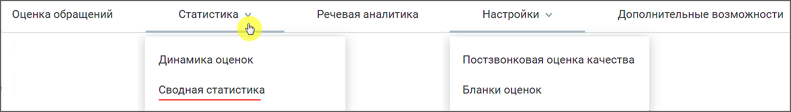
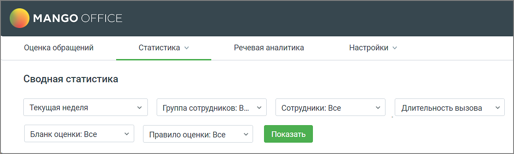
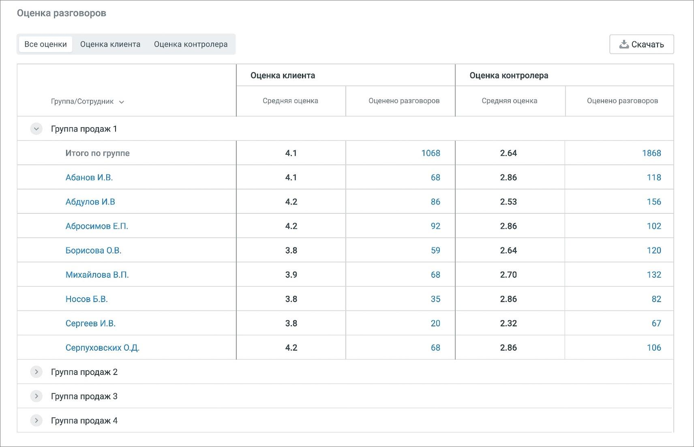
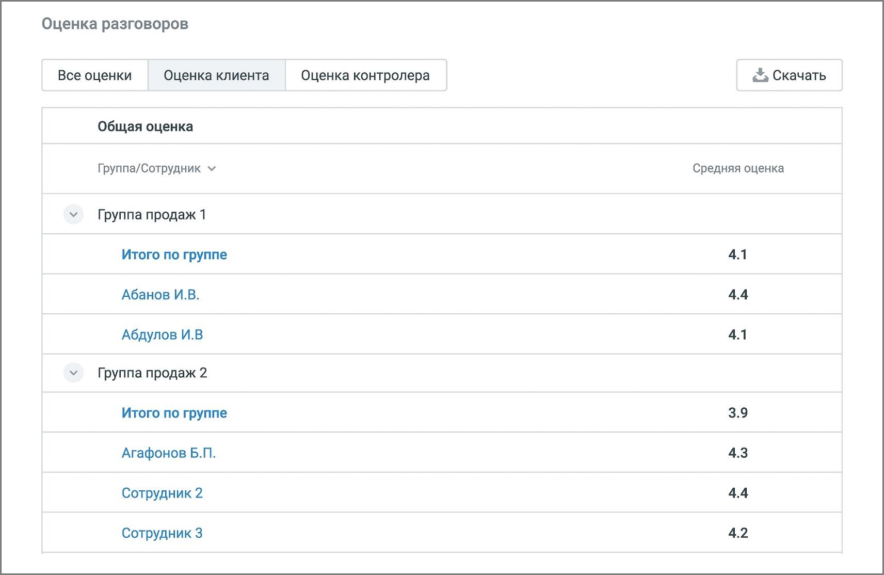
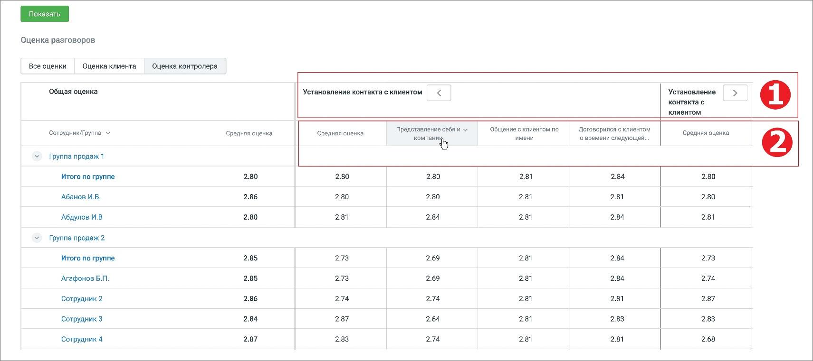

# 7.2. Сводная статистика

> Трассировка: PDF §7.2 · сквозные стр. 56-59 · источники: ч.1 `kb/mango-product-docs/sources/quality-managment/QM_manual_v-1.26.18.pdf` с.56-59.

В разделе отображаются таблицы сводной статистики оценок сотрудников ВАТС клиентами и контролерами в соответствии с заданными параметрами фильтрации.

Доступны три основных сводных отчета • Все оценки • Оценка клиента • Оценка контролера Вкладка ВСЕ ОЦЕНКИ

Отчет содержит общие оценки сотрудников с разбиением на группы. Оценка клиента/контролера: • средняя оценка – средняя оценка клиента/контролера разговоров сотрудников; • оценено разговоров – количество оцененных клиентом/контролером разговоров сотрудников. Вкладка ОЦЕНКА КЛИЕНТА Таблица клиентских оценок отображается, если в фильтре выбрано только одно правило оценки.

Если в выбранном Правиле настроены несколько вопросов, таблица отражает детальную статистику клиенткой оценки по каждому вопросу. Текст "н/д" означает отсутствие оценки за заданный период фильтрации. Вкладка ОЦЕНКА КОНТРОЛЕРА Таблица оценок контролера отображается, если в фильтре выбран только один бланк оценки

Блок 1 – наименование раздела бланка оценки; Блок 2 – наименование критерия бланка оценки. Если для критерия в бланке оценки был установлен коэффициент (вес критерия), значение коэффициента отображается справа от названия критерия.

Клик по пиктограмме сворачивает/разворачивает детализацию статистики по разделам. ЭКСПОРТ СТАТИСТИКИ По нажатию на кнопку Скачать в любом из отчетов Сводной статистики, открывается окно экспорта файла статистики в формате .csv. В окне следует выбрать сотрудников для экспорта. Также можно настроить параметры экспорта: кодировку, разделитель. Клик по кнопке Скачать отчет открывает стандартное окно проводника Windows с выбором пути сохранения файла отчета.
