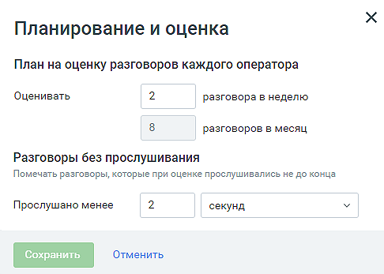
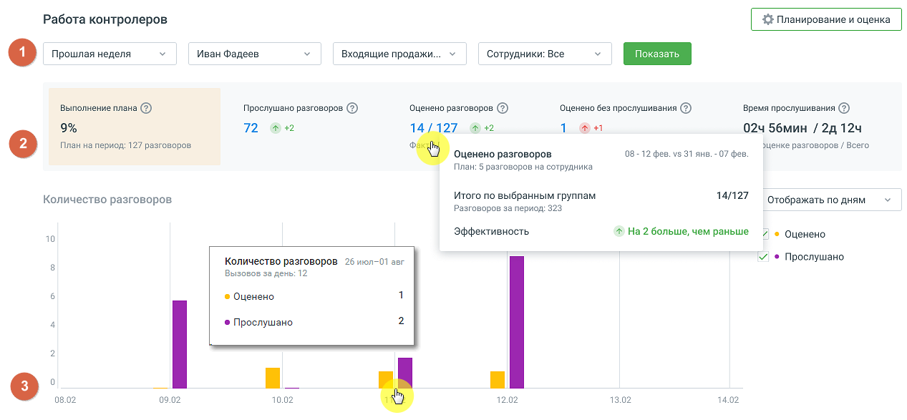
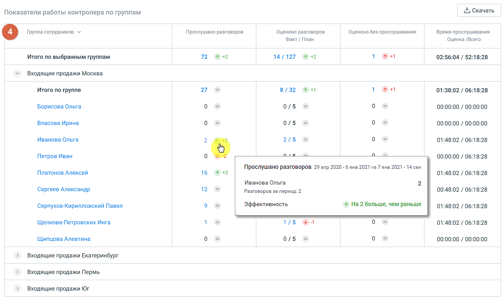

# 7.3. Работа контролеров

> Трассировка: PDF §7.3 · сквозные стр. 59-64 · источники: ч.1 `kb/mango-product-docs/sources/quality-managment/QM_manual_v-1.26.18.pdf` с.59-64.

| Важно: Отчет «Работа контролеров» доступна только тем пользователям, которые имеют статус |
| --- |
| «контролер». |

Отчет состоит четырех блоков: 1. Фильтры 2. Сводная статистика 3. График «Количество разговоров» 4. Таблица «Показатели работы контролера по группам»

Кнопка Планирование и оценка открывает окно для настройки плана и оценок работы контролеров.

В окне следует указать: • План на оценку разговоров каждого оператора: в неделю, на месяц; • Разговоры без прослушивания – задать время, по истечении которого разговор считается прослушанным. Сохраните внесенные изменения кликом по кнопке Сохранить.

Фильтры Для построения отчета воспользуйтесь следующими фильтрами: • Период – фильтрует оцененные вызовы по дате создания вызова: Текущая неделя, Текущий месяц, Произвольный (максимальное значение 1 год); • Выберите контролера – выпадающий список содержит список контролеров, расположенных в алфавитном порядке. Фильтрует вызовы, которые оценивал и/или прослушивал выбранный контролер. • Группа – выпадающий список содержит список групп, доступных пользователю, расположенных в алфавитном порядке; • Сотрудник – выпадающий список содержит сотрудников , относящихся к выбранной группе. Для формирования отчета установите параметры фильтрации и нажмите на кнопку Показать.

| Совет: Если кнопка Показать недоступна для нажатия, проверьте – во всех ли выпадающих |
| --- |
| списках выбраны данные для формирования отчета. |

Сводная статистика Виджет сводной статистики дает краткую информацию по прослушанным и/или оцененным звонкам с учетом выбранных фильтров.

Также в виджете присутствуют маркеры эффективности – и . Стрелки «вверх» и «вниз» показывают рост или снижение количества прослушанных и/или оцененных разговоров за выбранный период времени. Цвет маркера показывает выполнение (зеленый) или не выполнение (красный) плана, установленного в окне «Планирование и оценка».

График «Количество разговоров» Все данные графика отображаются с учетом выбранных фильтров: Выполнение плана – показывает процент выполнения плана по оценке разговоров выбранных сотрудников. Прослушано разговоров – в виджете отображается количество вызовов, которые были прослушаны контролером вне зависимости от наличия оценок по прослушанным разговорам. Оценено разговоров – количество разговоров, по которым была проставлена оценка. Оценено без прослушивания – оцененные разговоры, на прослушивание которых контролер затратил времени меньше, чем установлено в окне «Планирование и оценка». Время прослушивания – через «/» отображаются два показателя: • общая длительность прослушивания разговоров, которые были оценены; • общая длительность прослушивания всех разговоров.

| Примечание: Время прослушивания учитывает только время, затраченное выбранным |
| --- |
| контролером на прослушивание. Время по прослушиванию одного разговора одни контролером |
| суммируется |

Данные выводятся в разрезах: «по месяцам», «по неделям». Так же можно выбрать для отображения на графике оба или только один из вариантов: «оценено» или «прослушано». Клик по кнопке Скачать приводит к открытию стандартного окна экспорта данных. Экспорт производится в формат CSV, с учетом выбранных в фильтрах значений.

Таблица «Показатели работы контролера по группам»

Данные в таблице отсортированы по группам сотрудников. При наведении на любое значение в таблице всплывает окно с уточнением значения показателей.

| Клик по имени сотрудника открывает окно «Оценка звонков» по данному сотруднику за последние |
| --- |
| три месяца. |

Клик по кнопке Скачать приводит к открытию стандартного окна экспорта данных. Экспорт производится в формат CSV, с учетом выбранных в фильтрах значений.

