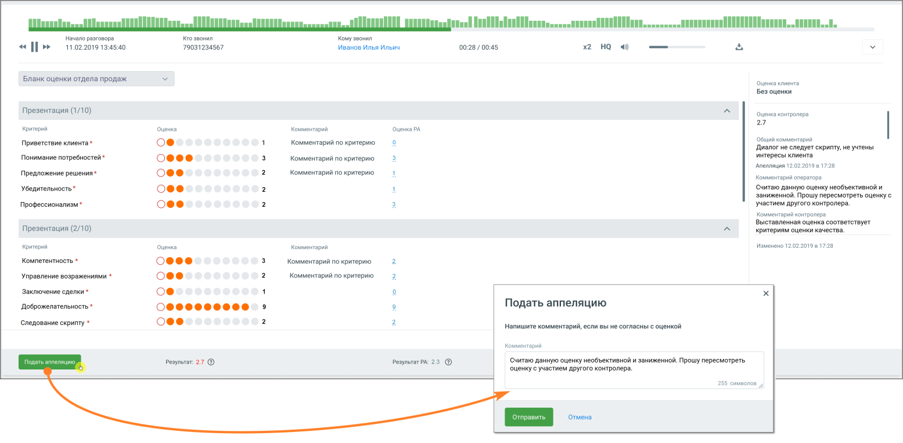

# 8.1. Как сотруднику подать апелляцию

> Трассировка: PDF §8.1 · сквозные стр. 64-65 · источники: ч.1 `kb/mango-product-docs/sources/quality-managment/QM_manual_v-1.26.18.pdf` с.64-65.

Если после получения уведомления сотрудник хочет подать апелляцию на пересмотр негативной оценки разговора, необходимо кликнуть на кнопку «Посмотреть оценку» в уведомлении.

Открывается лист разговора, с бланком и комментариями к оценке. Для подачи апелляции следует нажать кнопку «Подать апелляцию» в нижней части экрана. В появившемся окне можно добавить комментарий по существу апелляции и отправить её на рассмотрение. Диалог с контролером отображается в правой части экрана.

После повторного рассмотрения сотрудник получит уведомление о результате апелляции. В случае, если оценка была изменена на оценку выше, чем указано в настройках апелляции, уведомление не отправляется.
