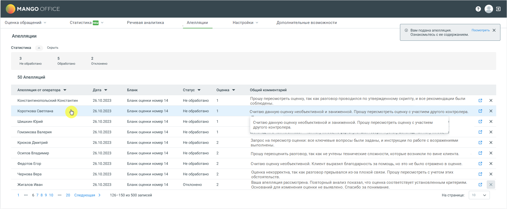

# 8.2. Как контролеру обрабатывать апелляции

> Трассировка: PDF §8.2 · сквозные стр. 65-67 · источники: ч.1 `kb/mango-product-docs/sources/quality-managment/QM_manual_v-1.26.18.pdf` с.65-67.

Контролер обрабатывает апелляции следующим образом:

1. Контролер заходит в раздел "Апелляции", где отображаются все апелляции, поданные ему на рассмотрение. 2. В этом разделе контролер видит список апелляций с деталями, такими как дата, бланк, текущая оценка и последний комментарий, оставленный в диалоге.

3. Контролер выбирает апелляцию для рассмотрения, нажав на пиктограмму в соответствующей строке. 4. Открывается окно с записью разговора, бланком и возможностью повторно оценить разговор. 5. Контролер анализирует разговор и комментарий оператора, после чего принимает решение: a. Если контролер согласен с оператором, он пересматривает оценку и вносит соответствующие изменения. b. Если контролер не согласен с апелляцией, он оставляет первоначальную оценку и отклоняет апелляцию, добавляя комментарий с обоснованием решения. 6. После обработки апелляции статус обновляется, и оператор получает уведомление о результате. В случае, если оценка была изменена на оценку выше, чем указано в настройках апелляции, уведомление не отправляется. 7. Оператору и контролеру доступен отчет по апелляциям, где они могут видеть текущий статус и результаты рассмотрения апелляций.

