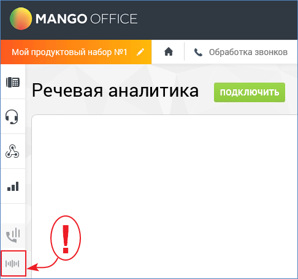
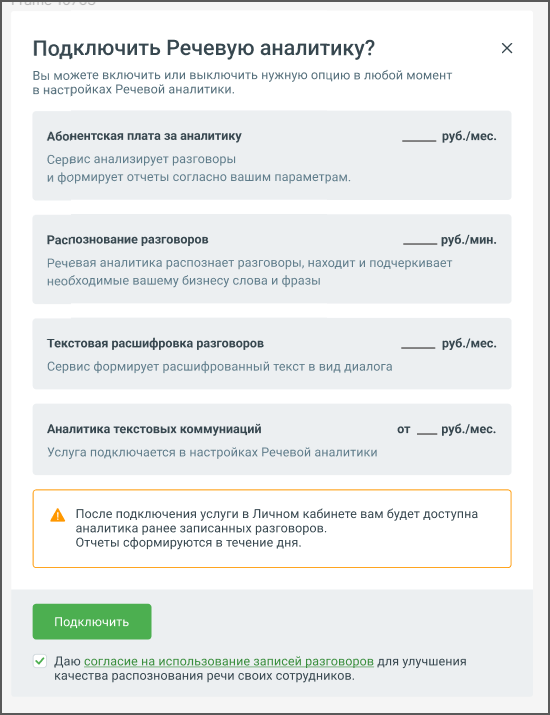

# 9.1. Подключение услуги Речевая аналитика

> Трассировка: PDF §9.1 · сквозные стр. 67-69 · источники: ч.1 `kb/mango-product-docs/sources/quality-managment/QM_manual_v-1.26.18.pdf` с.67-69.

Для подключения услуги "Речевая аналитика" в демо-режиме зайдите в Личный кабинет и найдите

на боковой навигационной панели иконку . Перейдите в подраздел Речевая аналитика. Нажмите кнопку Подключить.

Речевая аналитика может быть подключена в двух режимах: демо-режим (на 7 дней), полная версия (платная). Для демо-режима суммарная длительность распознаваемых звонков ограничена 100 минутами разговора за сутки. Остальной функционал полностью соответствует функционалу полной версии. По истечении 7 дней демоверсия деактивируется. Повторно подключить услугу в демо-режиме невозможно. После нажатия на кнопку Подключить появляется всплывающее окно с описанием расходов на подключение услуги.

Стоимость минуты распознавания разговора зависит от версии ВАТС. Подробнее о версии продукта и тарифах здесь.

| Важно: При первом подключении услуги “Речевая аналитика” обязательно подключите |
| --- |
| распознавание разговоров. |

В дальнейшем, при необходимости, инструменты “Распознавание” и “Расшифровка”, можно отключить: • Разговоры, записанные при отключенном инструменте “Распознавание”, распознаваться не будут. В этом случае Речевая аналитика формирует отчеты только по уже записанным и распознанным разговорам. • Если инструмент «Расшифровка разговоров» отключен, тексты разговоров на плеере не отображаются. Рабочая область раздела Речевая аналитика содержит вкладки: • Отчеты • Тегирование разговоров

• Настройки • Список текстовых коммуникаций • ИИ Помощники
