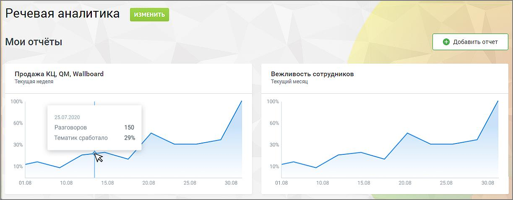

# 9.2. Вкладка ОТЧЕТЫ

> Трассировка: PDF §9.2 · сквозные стр. 69 · источники: ч.1 `kb/mango-product-docs/sources/quality-managment/QM_manual_v-1.26.18.pdf` с.69.

Вкладка Отчеты содержит детальную аналитическую информацию о распознанных вызовах в соответствии с заданными параметрами фильтрации. В подразделе Мои отчеты размещаются виджеты отчетов (не более 10-ти) с настроенными параметрами фильтрации, для быстрого перехода.

Доступны несколько отчетов: • Расходы Речевой аналитики – отчет помогает быстро понять, сколько стоит использование сервиса за выбранный период и какие услуги вносят основной вклад в затраты. • Анализ сотрудников • Анализ разговоров • Ловец инсайтов • Анализ по чек-листам Для построения любого из отчетов выберите отчетный промежуток времени, срез, показатели и фильтры. Каждый отчет содержит блок таблиц и блок визуализации.
