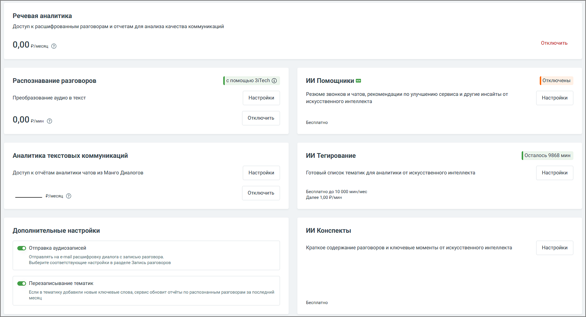

# 9.4. Вкладка НАСТРОЙКИ

> Трассировка: PDF §9.4 · сквозные стр. 72-73 · источники: ч.1 `kb/mango-product-docs/sources/quality-managment/QM_manual_v-1.26.18.pdf` с.72-73.

Вкладка Настройки модуля Речевая аналитика содержит блок онбординга, а также следующие блоки.

Услуга «Речевая аналитика» – отображается абонентская плата за услугу. Распознавание разговоров – отображается стоимость расшифровки и распознавания аудиозаписей разговоров. В настройках можно настроить условия распознавания аудиозаписей разговоров и выбрать технологию распознавания. Пользователь может отправлять на распознавание только нужные звонки. Аналитика текстовых коммуникаций – выбор тарифа и сотрудников, чьи текстовые коммуникации будут анализироваться. ИИ Инструменты 1. ИИ Помощники – инструмент для автоматического анализа диалогов по заданным правилам, который выдаёт не только краткое содержание, но также полезные выводы и рекомендации. 2. ИИ Конспекты – данная услуга Речевой Аналитики позволяет автоматически формировать краткое содержание диалога и выделять ключевые моменты с помощью искусственного интеллекта. При включённой функции Пробный период вы можете бесплатно протестировать работу ИИ Конспектов — до 100 минут обработанных разговоров в сутки. 3. ИИ Тегирование – услуга предоставляет возможность смыслового анализа разговоров на основе запросов к ИИ без подбора ключевых слов. Анализ разговоров с использованием ИИ-

запросов доступен только при активированных услугах «Абонентская плата» и «Распознавание разговоров». Элементы настройки услуги: a. Сотрудники: Выбор диапазона сотрудников для анализа. Пользователь может выбрать конкретных сотрудников для фильтрации разговоров. Необходимо убедиться, что выбранные для анализа сотрудники совпадают с теми, кто уже выбран для распознавания разговоров. b. Направление звонка: Позволяет выбрать направление (входящие, исходящие или внутренние звонки) по которому разговоры будут фильтроваться для отправки на тегирование.

| Важно: Стоимость услуги определяется на основе продолжительности анализируемых разговоров, |
| --- |
| а списание средств происходит каждую ночь. |

Все действия, произведенные в настройках Речевой аналитики, отражаются в Личном кабинете пользователя ВАТС в разделе Безопасность и ограничения/Журнал действий. Для удобного и последовательного ознакомления с функционалом Речевой аналитики разработан блок онбординга, который помогает быстро настроить все ключевые параметры и начать работу с сервисом.
