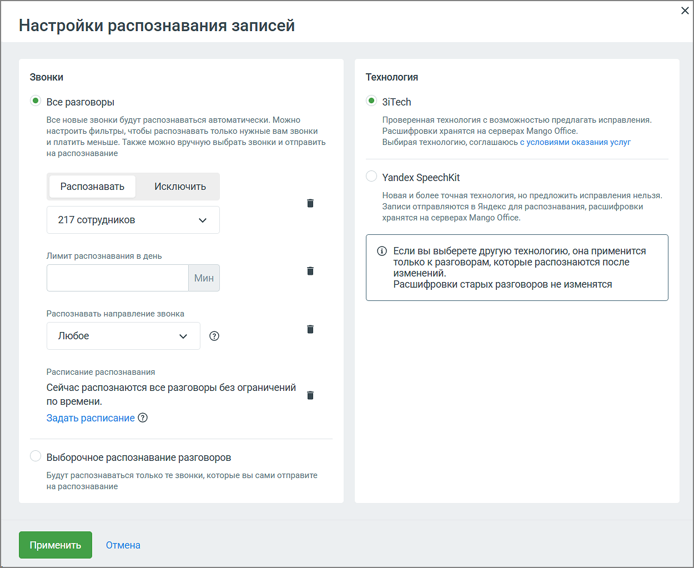

# 9.4.2. Настройки распознавания записей

> Трассировка: PDF §9.4.2 · сквозные стр. 75-77 · источники: ч.1 `kb/mango-product-docs/sources/quality-managment/QM_manual_v-1.26.18.pdf` с.75-77.

Блок Настройка распознавания записей позволяет настроить функции распознавания и пересылки аудиозаписей разговоров сотрудников. По нажатию на кнопку Настройки в Распознавании разговоров открывается окно настроек:

1. Режим распознавания: • Все разговоры — в этом режиме будут распознаваться все новые разговоры и записи, автоматически отправляемые на распознавание со страницы "Записи разговоров". • Выборочное распознавание разговоров — распознаются только те записи, которые вручную отправлены пользователем со страницы "Записи разговоров". 2. Управление сотрудниками — Распознавать/Исключить:

• Возможность выбрать сотрудников, чьи разговоры должны распознаваться или исключаться из распознавания. 3. Ограничения по номерам (если соответствующая услуга подключена): • В настройках распознавания возможно добавление ограничения по номерам телефонов, на которые будет распространяться функция распознавания. Эта настройка доступна не для всех пользователей и зависит от подключенной конфигурации услуги. Если данная опция активна, пользователю предоставляется возможность указать конкретные номера телефонов для входящих и исходящих вызовов, которые будут отправляться на распознавание. 4. Лимит распознавания в день: • Вводимое значение ограничивает количество минут разговоров, которые могут быть распознаны за один день. Пользователь может задать минимальное количество для обработки. 5. Направление звонков для распознавания (если соответствующая услуга подключена): Пользователь может выбрать направление звонков, которые будут распознаваться: • Входящие • Исходящие • Внутренние 6. Расписание распознавания (если соответствующая услуга подключена): • Пользователь может настроить время работы системы распознавания по дням недели. Клик по кнопке Задать расписание откроет окно настройки расписания. Зеленым цветом отмечено время, когда разговоры будут отправляться на распознавание. В соответствии с настроенным расписанием под распознавание будут попадать все (с учетом других настроек распознавания) записанные разговоры, время начала которых лежит в заданном интервале. Часовой пояс – Москва. • При необходимости можно обновить расписание через кнопку Обновить. 7. Выбор технологии распознавания – предлагается две технологии на выбор: c. 3iTech – проверенная технология с возможностью предлагать исправления, хранение расшифровок на серверах MANGO. При выборе 3iTech пользователю доступны 700 приветственных минут для распознавания звонков. d. Yandex SpeechKit – более точная технология, но без возможности внесения исправлений. Отправка записей в Яндекс для распознавания с последующим хранением расшифровок на серверах Mango Office. После настройки всех параметров необходимо нажать кнопку Применить для сохранения изменений.

Если внесенные изменения не требуются, можно выбрать Отмена, чтобы вернуться к предыдущим настройкам. Эти настройки дают гибкость в управлении процессом распознавания аудиозаписей, позволяют ограничить количество обрабатываемых записей, а также задать удобное расписание для работы системы.

| Важно: Для подключения отсутствующих услуг необходимо обращаться к Персональному |
| --- |
| менеджеру. |
