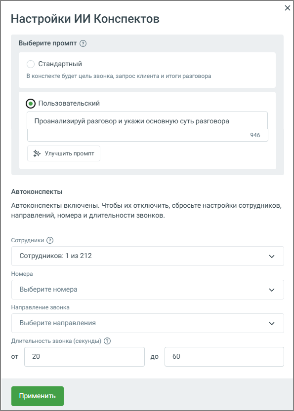

# 9.4.4.1. ИИ Конспекты

> Трассировка: PDF §9.4.4.1 · сквозные стр. 78-81 · источники: ч.1 `kb/mango-product-docs/sources/quality-managment/QM_manual_v-1.26.18.pdf` с.78-81.

Блок ИИ Конспекты позволяет автоматически формировать краткое содержание телефонных разговоров с помощью искусственного интеллекта. Это упрощает анализ диалогов и помогает быстро понять суть общения без необходимости прослушивания каждой записи.

Функциональные возможности блока: 1. Автоматическое создание краткого резюме для каждого обработанного звонка — выделение ключевых моментов разговора, включая суть обращения клиента, действия и предложения оператора, а также итог. Резюме отображается рядом с деталями звонка и формируется на основе выбранного промпта. Доступны два варианта: стандартный промпт от MANGO OFFICE или настраиваемый пользовательский промпт до 1000 символов.

2. Обработка разговоров с подключённой речевой аналитикой — ИИ Конспекты доступны только для звонков, прошедших распознавание. При выборе звонка, который не был расшифрован, запись звонка отправляется на расшифровку и дальнейшее конспектирование. 3. Формирование архивов и выгрузка — возможность экспортировать резюме для внешнего анализа или отчётности. 4. Возможность отключения — если пользователю больше не требуется данная функция, ее можно легко отключить с помощью кнопки Отключить. 5. При включённой функции Пробный период вы можете бесплатно протестировать работу ИИ Конспектов — до 100 минут обработанных разговоров в сутки.

Настройки ИИ Конспектов Нажмите кнопку Настройки на плитке ИИ Конспекты и откройте окно настроек:

Задайте параметры, по которым будет формироваться конспект: • В блоке «Выберите промт» вы можете выбрать стандартный промпт от MANGO OFFICE или создать свой. При выборе «Пользовательский» откроется текстовое поле «Свой промпт

конспекта», где можно ввести собственный шаблон. Ограничение по длине промпта - 1000 символов. • Вы всегда можете вернуться к стандартному промпту от MANGO OFFICE, выбрав соответствующую опцию, или отредактировать сохранённый пользовательский промпт. • Сохранённый промпт автоматически применяется для конспектирования, запускаемого как из Журнала разговоров, так и из плеера. Все изменения промпта (создание и редактирование) фиксируются в журнале событий для отслеживания. • Сотрудники - выберите конкретных сотрудников, чьи разговоры нужно обрабатывать. Это позволяет исключить технические номера, ботов и т. д. • Направление звонка - уточните, какие звонки нужно обрабатывать: входящие, исходящие, внутренние. Это позволяет ещё точнее ограничить круг анализируемых звонков. • Длительность звонка - задайте минимальную и максимальную длительность звонков (в секундах), для которых будут автоматически создаваться ИИ-конспекты. Звонки, не попадающие в заданный диапазон, автоматически пропускаются системой. совет

| Используйте кнопку «Улучшить промпт» для получения рекомендаций по оптимизации текста. |
| --- |
| Убедитесь, что ваш промпт чётко определяет желаемые элементы конспекта, такие как краткое |
| содержание, предложения оператора и удовлетворённость клиента. |

После настройки нажмите кнопку Применить, чтобы сохранить параметры.
