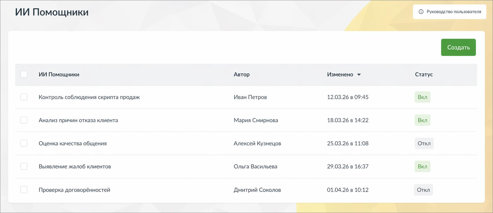

# 9.4.4.3.1. Что это такое и зачем нужно

> Трассировка: PDF §9.4.4.3.1 · сквозные стр. 83 · источники: ч.1 `kb/mango-product-docs/sources/quality-managment/QM_manual_v-1.26.18.pdf` с.83.

ИИ Помощники - это инструмент, который позволяет автоматически анализировать разговоры по заданным вами правилам и получать не только краткое содержание, но и полезные выводы и рекомендации.

В отличие от стандартных ИИ Конспектов, ИИ Помощники можно настраивать под конкретные задачи бизнеса. Вы сами определяете, что именно нужно искать и как интерпретировать разговор. С помощью ИИ Помощников вы можете: • контролировать соблюдение скриптов • выявлять проблемы в диалогах с клиентами • получать рекомендации по улучшению работы сотрудников • анализировать разговоры с разных точек зрения одновременно Один и тот же разговор может быть обработан несколькими помощниками, и каждый из них даст свой результат.
