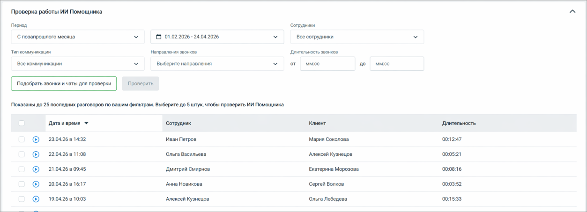
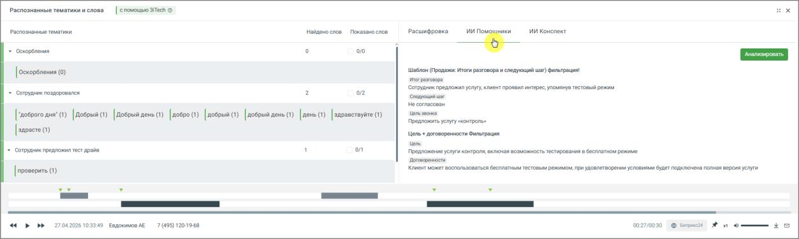

# 9.4.4.3.4. Где смотреть результаты

> Трассировка: PDF §9.4.4.3.4 · сквозные стр. 87-90 · источники: ч.1 `kb/mango-product-docs/sources/quality-managment/QM_manual_v-1.26.18.pdf` с.87-90.

Чтобы посмотреть результат анализа: 1. Настройте фильтры

2. Откройте запись разговора 3. Нажмите кнопку прослушивания 4. В плеере перейдите во вкладку ИИ Помощники

Здесь отображаются: • ответы всех активных помощников • результаты анализа по каждому из них Один разговор может содержать несколько ответов - по числу активных помощников. Особенности работы • каждый помощник работает независимо • один разговор может содержать несколько ответов - по числу активных ИИ Помощников • по умолчанию обрабатываются разговоры от 20 секунд, если иная длительность не задана в фильтре • результаты отображаются вместе с расшифровкой, ИИ Конспектом и тематиками из любых отчетов • помощники анализируют разговоры автоматически после их расшифровки Рекомендации • создавайте отдельных помощников под разные задачи • формулируйте промпт максимально конкретно • проверяйте результат на тестовых звонках перед использованием • при необходимости используйте кнопку Улучшить для доработки запроса Примеры пользовательских сценариев Пример 1. Контроль соблюдения скрипта продаж Ситуация: Руководителю важно понимать, задают ли менеджеры обязательные вопросы клиенту. Действия: 6. Пользователь создаёт ИИ Помощника

7. В поле «Промпт» указывает: «Проверь, задал ли сотрудник вопрос о потребностях клиента. Ответь Да или Нет и приведи фрагмент диалога» 8. В фильтрах выбирает: • сотрудников отдела продаж • входящие звонки Результат: В плеере для каждого звонка появляется ответ: • Да / Нет • цитата из разговора Польза: Можно быстро выявить сотрудников, которые не соблюдают скрипт. Пример 2. Поиск причин отказа клиента Ситуация: Компания хочет понять, почему клиенты не покупают. Действия: 1. Создаётся ИИ Помощник 2. Промпт: «Определи, была ли в разговоре причина отказа. Если была - сформулируй её кратко» 3. Фильтр: • все звонки • длительность более 30 секунд Результат: В каждом разговоре появляется: • причина отказа (если есть) • либо отметка, что отказ не выявлен Польза: Позволяет собрать статистику причин отказов без ручного прослушивания. Пример 3. Контроль качества общения Ситуация: Нужно оценить, насколько корректно сотрудники общаются с клиентами. Действия: 1. Создаётся ИИ Помощник 2. Промпт: «Оцени вежливость сотрудника по шкале от 1 до 5 и объясни оценку» 3. Фильтр: • все сотрудники контакт-центра Результат: Для каждого звонка: • оценка • комментарий

Польза: Можно быстро выявить проблемные диалоги и сотрудников. Пример 4. Разные виды анализа одного звонка Ситуация: В звонках нужно одновременно контролировать несколько аспектов. Действия: Создаются несколько ИИ Помощников: • один - проверяет скрипт • второй - ищет жалобы • третий - оценивает результат звонка Результат: В одном разговоре отображаются: • несколько ответов от разных помощников Польза: Один звонок анализируется сразу по нескольким критериям. Пример 5. Анализ только нужных звонков Ситуация: Нужно анализировать только длинные разговоры поддержки. Действия: 1. Создаётся ИИ Помощник 2. Настраивается фильтр: • входящие звонки • длительность более 2 минут • сотрудники поддержки Результат: Анализируются только релевантные разговоры Польза: Снижается шум, анализ становится точечным
