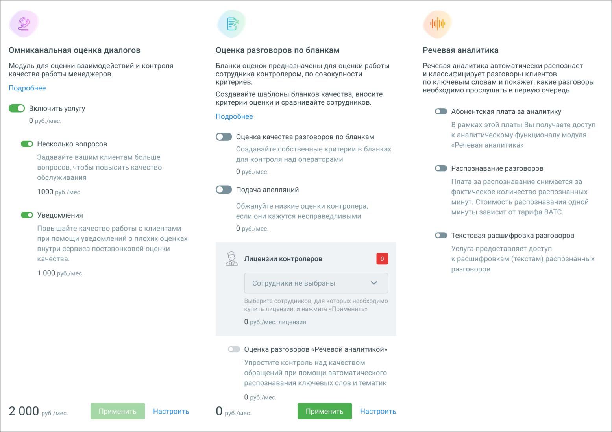

# 10. Дополнительные возможности

> Трассировка: PDF §10 · сквозные стр. 97 · источники: ч.1 `kb/mango-product-docs/sources/quality-managment/QM_manual_v-1.26.18.pdf` с.97.

В разделе «Дополнительные возможности» доступно подключение и настройка дополнительных блоков модуля Контроль качества.

Настройка Речевой аналитики осуществляется в Личном кабинете ВАТС. Переключатель «Оценка разговоров Речевой аналитикой» доступен только при условии подключенной услуги Речевая аналитика. Если переключатель включен, то при помощи Речевой аналитики вы можете оценивать качество обслуживания с точностью, близкой к контролеру. Таким образом можно охватить 100% разговоров сотрудников и получить более точную оценку качества. Ознакомьтесь с условиями и самостоятельно подключите блоки, проставив соответствующие переключатели и кликнув по кнопкам Применить или Подключить (в зависимости от выбранного блока и состояния услуги). После подключения блока необходимо произвести его настройки.
