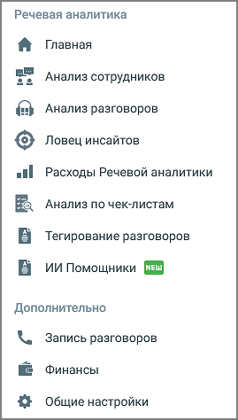

# 1.2. Меню «Речевая аналитика»

> Трассировка: PDF §1.2 · сквозные стр. 7-9 · источники: ч.1 `kb/mango-product-docs/sources/speech-analytics/RECHEVAYA-ANALITIKA_c-KATS_v.1.26.18.pdf` с.7-9.

Меню Речевой аналитики (тариф «КАТС») MANGO OFFICE размещается вертикально, в левой части окна.

Речевая аналитика: 1. Главная – дашборд, страница с виджетами отчетов Речевой аналитики 2. Расходы Речевой аналитики – общий отчет о расходах на Речевую аналитику 3. Анализ сотрудников – отчет Анализ сотрудников 4. Анализ разговоров – отчет Анализ разговоров 5. Анализ по чек-листам – отчет Анализ по чек-листам 6. Ловец инсайтов – отчет Ловец инсайтов 7. Тегирование разговоров – список настроенных тематик 8. ИИ Помощники – анализ диалогов с выводами и рекомендациями Дополнительно 9. Запись разговоров – настройка и прослушивание записей разговоров 10. Финансы – управление финансами Личного кабинета. Порядок использования см. в полном Справочнике ВАТС Mango OFFICE • Документы • Договоры • Расходы на продукт • Платежи • Пополнить счет Речевая аналитика & КАТС | v.1.26.18 7

| 8 800 555 55 22, mango-office.ru |  |
| --- | --- |
|  | mango@mangotele.com |

• Автоплатеж • Реквизиты • Уведомления 11. Общие настройки: • Речевая аналитика – настройки тематик, распознавания, графика • Сотрудники и группы - добавление, удаление, просмотр, формирование групп • Безопасность и ограничения – управление безопасностью и доступом: пароль/2FA, журнал действий, роли и права, ограничения сессии, SSO, ограничения доступа по IP • Облачное хранилище – настройка хранения записей и текстов распознанных разговоров в защищённом облаке, управление объёмом и уведомления о заполнении • Подключение по LDAP – интеграция с LDAP для синхронизации данных о сотрудниках (мастер настройки: подключение, атрибуты, сопоставление, расписание синхронизации) • Настройка SIP – подключение и настройка SIP Trunk для работы с КАТС: параметры соединения, DTMF, правила маршрутизации и привязка транка к сотрудникам • Управление услугами – раздел со списком отдельно подключаемых дополнительных услуг и быстрым переходом к их управлению/настройке (для администратора) Речевая аналитика & КАТС | v.1.26.18 8

| 8 800 555 55 22, mango-office.ru |  |
| --- | --- |
|  | mango@mangotele.com |
