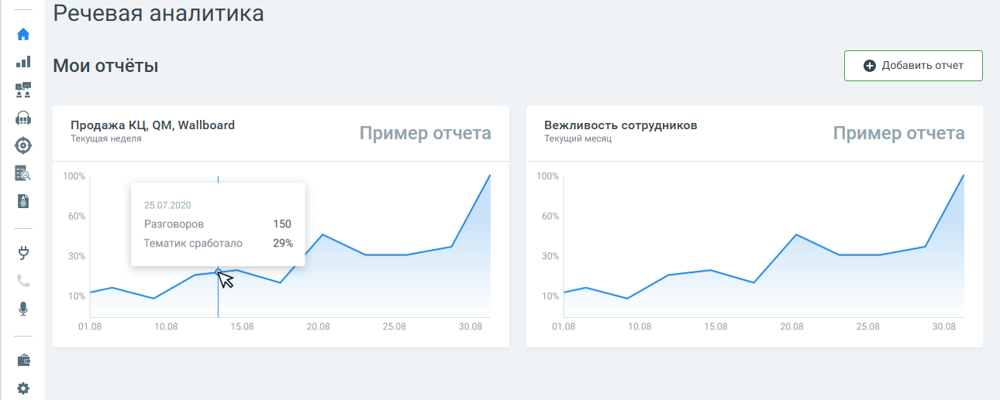

# 2. Мои отчеты

> Трассировка: PDF §2 · сквозные стр. 9 · источники: ч.1 `kb/mango-product-docs/sources/speech-analytics/RECHEVAYA-ANALITIKA_c-KATS_v.1.26.18.pdf` с.9.

Вкладка Мои отчеты содержит детальную аналитическую информацию о распознанных вызовах в соответствии с заданными параметрами фильтрации. Здесь размещаются виджеты отчетов (не более 10-ти) с настроенными параметрами фильтрации, для быстрого перехода. Чтобы добавить новый виджет, нажмите кнопку Добавить отчет, установите фильтры отчета и сохраните его.

При нажатии на кнопку сохранения отображается список доступных вариантов сохранения – таблица, график, таблица и график. Сохранение виджета выполняется только после выбора одного из вариантов. Также доступны отчеты: Расходы Речевой аналитики Анализ сотрудников Анализ разговоров Анализ по чек-листам Ловец инсайтов
