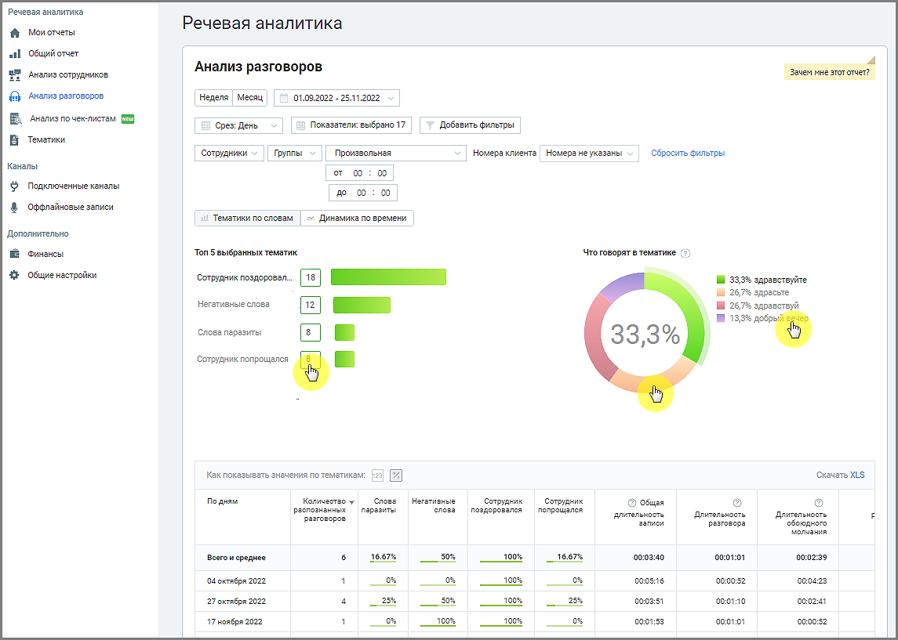
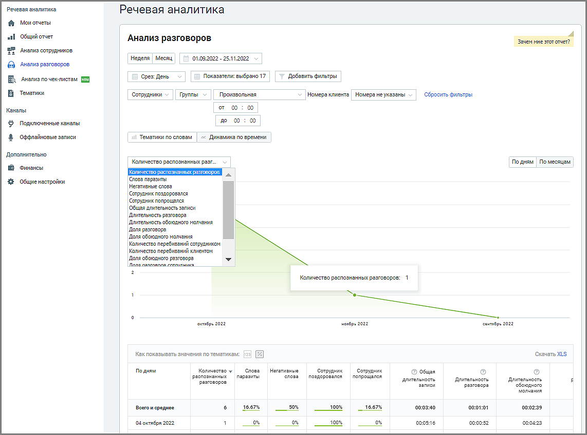

# 2.3. Анализ разговоров

> Трассировка: PDF §2.3 · сквозные стр. 18-22 · источники: ч.1 `kb/mango-product-docs/sources/speech-analytics/RECHEVAYA-ANALITIKA_c-KATS_v.1.26.18.pdf` с.18-22.

Отчет «Анализ разговоров» состоит из блока фильтров и двух блоков отчетности: Блока таблицы и Блока визуализаций Тематики по словам и Динамика по времени. Блоки визуализаций отображаются по нажатии на соответствующей вкладке: Визуализация “Тематики по словам” В поле визуализации “Тематики по словам” отображается: Топ 5 выбранных тематик – наиболее популярные тематики (не более 5-ти) из тематик, выбранных пользователем во всплывающем окне “Показатели”, подраздел Количество разговоров по тематикам. Позволяет определить какие из установленных тематик содержат наибольшее количество разговоров. Таким образом руководитель может видеть, к примеру, вектор заинтересованности клиентов в тех или иных товарах. Клик по любой из предложенных тематик позволяет увидеть подробную детализацию по этой тематике. Что говорят в тематике – для тематики, выбранной в “ТОП-5 популярных тематик”, показывает процентное соотношение распознанных терм по отношению к общему количеству терм тематики. В гистограмме отображается не более 10 строк. Если тематика содержит более 10 терм, наименее популярные из них помечаются, как Прочие. Речевая аналитика & КАТС | v.1.26.18 18

| 8 800 555 55 22, mango-office.ru |  |
| --- | --- |
|  | mango@mangotele.com |

Визуализация “Динамика по времени” Визуализация “Динамика по времени” представляет собой график изменений выбранного показателя в заданный период времени. Выпадающий список в левом верхнем углу графика содержит доступные для выбора показатели. При наведении курсора на элементы графика отображается всплывающая подсказка с информацией по соответствующему дню/месяцу. Речевая аналитика & КАТС | v.1.26.18 19

| 8 800 555 55 22, mango-office.ru |  |
| --- | --- |
|  | mango@mangotele.com |

Блок таблицы

Таблица формируется по срезу День/Месяц/Год и заданным пользователем в окне “Показатели” параметрам. Таблица может включать следующие данные:

Срез: день, месяц или год. Этот показатель присутствует в таблице всегда.

Показатели: • Название тематики – в примере на скриншоте выбрана тематика «Акционные предложения». Речевая аналитика & КАТС | v.1.26.18 20

| 8 800 555 55 22, mango-office.ru |  |
| --- | --- |
|  | mango@mangotele.com |

При выборе для отчета большего количества тематик данные по каждой из них будут отображаться в отдельном столбце. Где заголовок – название выбранной тематики. ВАЖНО: Данные столбца могут отображаться в двух вариантах: 1) В виде процентного соотношения разговоров в срезе, отнесенных к данной тематике, к общему числу разговоров в срезе; 2) В числовом виде – количество разговоров в срезе, отнесенных к данной тематике; • Количество распознанных разговоров. Этот показатель присутствует в таблице всегда • Общая длительность записи • Длительность разговора • Длительность обоюдного молчания • Доля разговора • Доля обоюдного молчания • Количество перебиваний сотрудником • Количество перебиваний клиентом • Доля обоюдного разговора • Доля разговора сотрудника • Доля разговора клиента • Скорость разговора сотрудника • Скорость разговора клиента

Чтобы узнать правило расчета каждого из показателей, наведите курсор на пиктограмму возле наименования показателя. Для фильтрации данных отчета по возрастанию/убыванию следует щелкнуть по наименованию столбца. Детализация разговоров По клику на показатель "Количество распознанных разговоров" открывается окно детализации разговоров за выбранный период времени. Также можно просмотреть записи разговоров по конкретным тематикам. Для этого необходимо включить отображение данных по тематикам, как числовое. Окно детализации разговоров содержит следующие данные о разговорах: • Время • Кто звонил • С кем говорил • Эмоции клиента • Эмоции сотрудника • Длительность разговора • Список тематик, которые распознаны в разговоре • Общая длительность записи • Длительность разговора • Длительность обоюдного молчания Речевая аналитика & КАТС | v.1.26.18 21

| 8 800 555 55 22, mango-office.ru |  |
| --- | --- |
|  | mango@mangotele.com |

• Доля разговора/обоюдного молчания • Количество перебиваний сотрудником/клиентом • Доля обоюдного разговора/сотрудника/клиента • Скорость разговора сотрудника/клиента В окне детализации разговоров пользователю доступны следующие действия: поиск по записям, прослушивание, просмотр расшифровки разговора (при наличии), скачивание аудиозаписи и расшифровки разговора. Экспорт данных Предусмотрен экспорт файла отчета «Тематики по словам» в формате XLS. После клика на кнопку – скачать расшифровку будет открыто стандартное диалоговое окно браузера, позволяющее сохранить файл.
