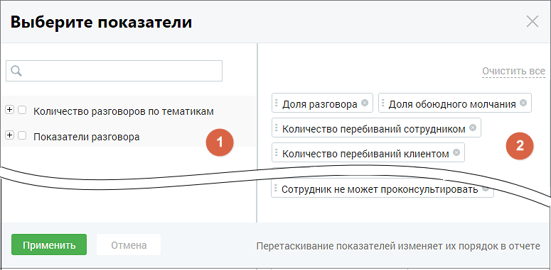

# 2.6. Показатели отчетов

> Трассировка: PDF §2.6 · сквозные стр. 41-43 · источники: ч.1 `kb/mango-product-docs/sources/speech-analytics/RECHEVAYA-ANALITIKA_c-KATS_v.1.26.18.pdf` с.41-43.

Для построения отчетов устанавливаются показатели, по которым будет формироваться отчет. Для этого нажмите на поле «Показатели».

Окно выбора показателей содержит две группы: В группе «Количество разговоров по тематикам» отображаются все тематики продукта: предустановленные и созданные пользователем, включая неактивные. По этим показателям можно проанализировать корректность речи сотрудника и речь клиента. Группа «Показатели разговора» включает в себя следующие характеристики разговора: Средняя длительность записи – показывает общую длительности записи с момента ее включения до окончания разговора; Средняя длительность разговора – показывает суммарное количество времени, когда хотя бы один из участников разговора говорил; Средняя длительность молчания – показывает, сколько времени сотрудник тратит на поиск информации, требующейся клиенту, а также насколько быстро сотрудник может ответить на вопросы клиента. Доля разговора – отношение длительности разговора к общей длительности записи. Позволяет понять, какую долю от общего времени записи собеседники были заняты разговором; Доля обоюдного молчания – отношение длительности обоюдного молчанию к длительности записи. Позволяет понять, какую долю от общего времени записи клиент ожидает ответа сотрудника; Количество перебиваний сотрудником – позволяет понять, сколько раз сотрудник перебил клиента; Речевая аналитика & КАТС | v.1.26.18 41

| 8 800 555 55 22, mango-office.ru |  |
| --- | --- |
|  | mango@mangotele.com |

Количество перебиваний клиентом – позволяет понять, сколько раз клиент перебил сотрудника. Если у какого-то сотрудника этот показатель сильно отличается от остальных, то, вероятно, способ донесения сотрудником информации не соответствует ожиданиям клиента; Доля обоюдного разговора – доля разговора, когда клиент и сотрудник говорили одновременно. Позволяет понять стиль общения сотрудника с клиентом; Доля разговора сотрудника – доля разговора, когда говорил только сотрудник. Позволяет понять, ведет ли сотрудник беседу, или её ведет клиент; Доля разговора клиента – доля разговора, когда говорил только клиент. Позволяет понять, ведет ли сотрудник беседу, или её ведет клиент; Скорость разговора клиента (количество слов в секунду); Скорость разговора сотрудника (количество слов в секунду) – позволяет анализировать, как сотрудник подстраивается под скорость речи клиента. Сравнив этот показатель среди всех сотрудников, можно понять, кто слишком быстро говорит, а кто говорит чересчур медленно. Данные выбранных чекбоксов в таблице «Показатели разговора» отчета «Анализ разговоров» отображаются, как столбцы. Выбранные показатели отображаются на правой стороне окна показателей (блок 2). Для

удаления показателя из списка выбранных нажмите пиктограмму удаления в строке показателя. Для сохранения внесенных изменений нажмите на кнопку «Применить».

Если нажать кнопку «Отменить» или пиктограмму , изменения не будут внесены, а выборка показателей вернется к последней сохраненной версии. Речевая аналитика & КАТС | v.1.26.18 42

| 8 800 555 55 22, mango-office.ru |  |
| --- | --- |
|  | mango@mangotele.com |
