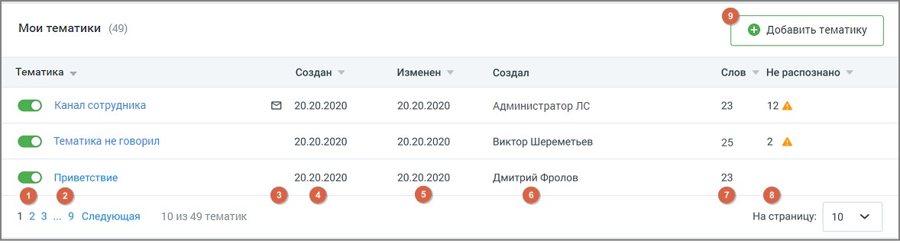

# 3.1. Тематики

> Трассировка: PDF §3.1 · сквозные стр. 43-44 · источники: ч.1 `kb/mango-product-docs/sources/speech-analytics/RECHEVAYA-ANALITIKA_c-KATS_v.1.26.18.pdf` с.43-44.

Рабочая область вкладки «Тематики» содержит: • Поиск по тематикам; • Фильтр по группам тематик; • Кнопка добавления тематики; • Таблицы по каждой группе тематик. Поиск по тематикам

Поле поиска позволяет искать тематики по запросу (без учета словоформ запроса): • в названиях тематик – найденная строка подсвечивается в результатах поиска; • в термах в составе тематик – включая предустановленные тематики (полное содержимое таких тематик скрыто в целях защиты авторских прав); • в создателях тематик (ФИО) – найденная строка подсвечивается в результатах поиска. Фильтр по группам тематик Фильтр-переключатель ограничивает вывод тематик по группам: Мои тематики, Совместные, Предустановленные. Доступность групп тематик определяется правами пользователя. Тематика может иметь статус Активна/Неактивна. Распознанному разговору может присваиваться только активная тематика. Речевая аналитика & КАТС | v.1.26.18 43

| 8 800 555 55 22, mango-office.ru |  |
| --- | --- |
|  | mango@mangotele.com |

1. Тумблер – для новых тематик по умолчанию включен. Система проверяет на вхождение только записи, распознанные после включения тумблера; 2. Название тематики; 3. Пиктограмма настроенных оповещений; о срабатывании тематики; 4. Когда создана тематика – дата в формате "ДД.ММ.ГГГГ"; 5. Когда изменена тематика – дата в формате "ДД.ММ.ГГГГ"; 6. Кем создана тематика – ФИО, для всех тематик, кроме предустановленных; 7. Количество слов в тематике – общее количество распознанных и нераспознанных терм в составе тематики; 8. Количество не распознанных слов – общее количество нераспознанных слов в составе тематики на момент отображения данных; 9. Кнопка добавления новой тематики. Для сортировки данных таблицы кликните по наименованию столбца.
