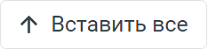

# 3.2.1. Ключевые слова

> Трассировка: PDF §3.2.1 · сквозные стр. 45-47 · источники: ч.1 `kb/mango-product-docs/sources/speech-analytics/RECHEVAYA-ANALITIKA_c-KATS_v.1.26.18.pdf` с.45-47.

Блок ключевых слов содержит следующие поля: Название тематики. По умолчанию новая тематика именуется Новая тематика. Изменить

название можно, щелкнув по пиктограмме . Допускается ввод не более 64 символов. Ключевые слова. При вводе терм в поле "Ключевые слова" производится проверка на наличие каждого слова в словаре распознавания (с учетом словоформ). Если введенное слово отсутствует в словаре, оно выделяется пиктограммой «!». Вероятно, в написании слова имеется ошибка, поэтому оно не может быть распознано. Речевая аналитика предложит исправить слово или добавить его в словарь распознавания. Языковая модель Речевой аналитики регулярно обновляется новыми словами, добавленными пользователями в словарь распознавания.

Подробнее о том, как сформулировать поисковый запрос, узнайте здесь. Блок ИИ Тегирование. При помощи ИИ (искусственного интеллекта) пользователь может подобрать синонимы и аналогичные выражения к своему списку ключевых слов. Для этого требуется указать несколько ключевых слов и нажать на кнопку «Подобрать слова». После этого в появившемся списке можно выбрать любое слово, и оно автоматически добавится в поле ключевых слов тематики. Также в блоке ИИ доступны следующие действия:

– клик по кнопке добавляет все предложенные синонимы в поле ключевых слов тематики.

– обновить список синонимов.

– удалить все синонимы.

– отметить предложенные синонимы как подходящие или неподходящие. Речевая аналитика & КАТС | v.1.26.18 45

| 8 800 555 55 22, mango-office.ru |  |
| --- | --- |
|  | mango@mangotele.com |

После ввода ключевых слов следует настроить опции распознавания, кликнув по кнопке Расширенные настройки. Речевая аналитика & КАТС | v.1.26.18 46

| 8 800 555 55 22, mango-office.ru |  |
| --- | --- |
|  | mango@mangotele.com |
