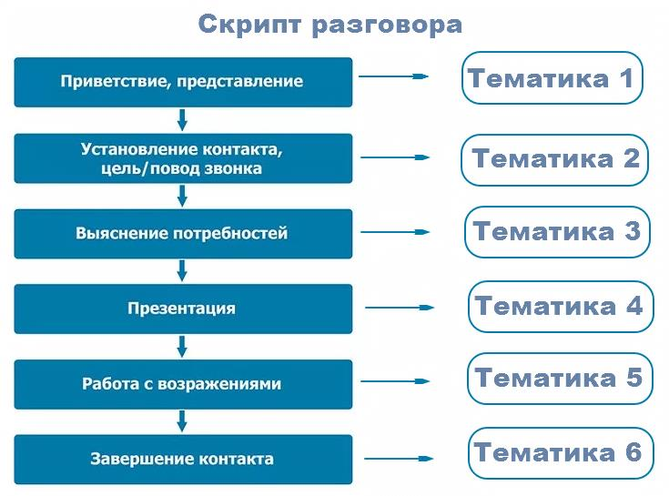

# 3.3. Советы по настройке тематик

> Трассировка: PDF §3.3 · сквозные стр. 50-53 · источники: ч.1 `kb/mango-product-docs/sources/speech-analytics/RECHEVAYA-ANALITIKA_c-KATS_v.1.26.18.pdf` с.50-53.

| 8 800 555 55 22, mango-office.ru |  |
| --- | --- |
|  | mango@mangotele.com |

ПРИМЕР: В двух уведомлениях выбраны идентичные сотрудники, e-mail и номера телефона. В этом случае каждое из этих уведомлений рассылается независимо от другого. 2. Если на один e-mail/номер телефона настроено более одного уведомления «за прошлый день» (на, соответственно, более чем одну тематику), то информация агрегируется в одном письме/СМС. 3. Если на один e-mail/номер телефона настроено более одного уведомления «за прошлую неделю» (на, соответственно, более чем одну тематику), то информация агрегируется в одном письме/СМС. 4. Пользователям, желающим получать уведомления на разговорах «клиент-клиент» (например, на ЛК без сотрудников, используемой только для Речевой аналитики) для получения таких уведомлений необходимо выбрать в настройках хотя бы одного сотрудника. Советы по настройке тематик 3.3. Создавайте простые тематики, чтобы одна тематика решала максимум одну задачу. Лучше создать несколько узконаправленных тематик, нежели одну общую. ПРИМЕР Известны основные конкуренты компании, их преимущества, отличия и т. д. Клиенты в разговоре с сотрудниками сравнивают продукты компании с продуктами конкурентов, и руководителю важно понимать, с какими конкурентами сравнивают. Знать параметры – по каким компания выигрывает, по каким проигрывает. Таким образом можно запланировать изменения в продукте/ценовой политике/ позиционировании на рынке и т. д. Решение: Создаем отдельные тематики для каждого из конкурентов с условиями Клиент, Говорил, Во всем разговоре и смотрим, как их упоминание меняется в динамике по времени. На основании полученных данных в работу компании вносятся изменения: меняется ценовая политика, корректируются позиционирование продукта, уникальное торговое предложение, скрипты продаж. Создавайте несколько тематик для решения одной задачи. По данным отчетов вы сможете увидеть, на каком этапе разговора у сотрудников возникают проблемы. Речевая аналитика & КАТС | v.1.26.18 50

| 8 800 555 55 22, mango-office.ru |  |
| --- | --- |
|  | mango@mangotele.com |

При настройке тематик не задавайте противоречащие друг другу условия. Пример двух противоречащих Условий 1 и 2 в одной тематике:

Речевая аналитика & КАТС | v.1.26.18 51

| 8 800 555 55 22, mango-office.ru |  |
| --- | --- |
|  | mango@mangotele.com |

Для заполнения поля “Какие слова ищем” ознакомьтесь с тем, как работает поиск по распознанным записям разговоров. Создавайте тематику из нескольких условий, только если это необходимо для решения конкретной задачи. Например, если в одном разговоре требуется проанализировать отдельно два канала – сотрудник и клиент – на соответствие разным условиям.

Речевая аналитика & КАТС | v.1.26.18 52

| 8 800 555 55 22, mango-office.ru |  |
| --- | --- |
|  | mango@mangotele.com |
