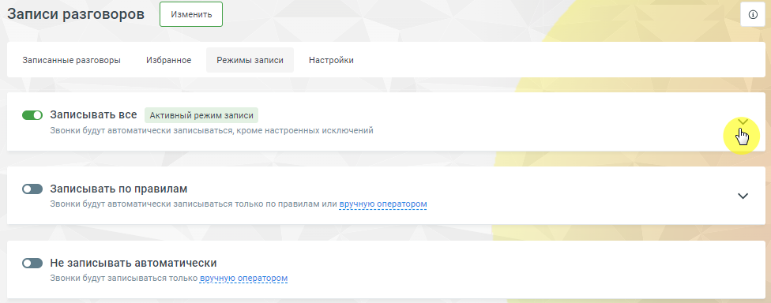
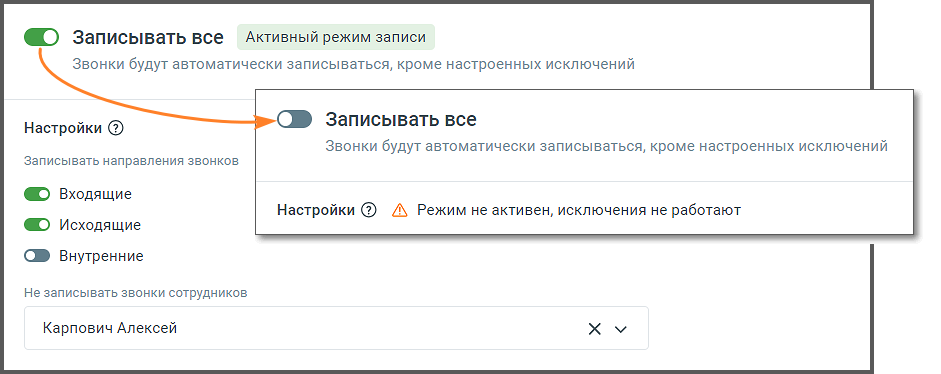

# 4.3. Режимы записи

> Трассировка: PDF §4.3 · сквозные стр. 70-75 · источники: ч.1 `kb/mango-product-docs/sources/speech-analytics/RECHEVAYA-ANALITIKA_c-KATS_v.1.26.18.pdf` с.70-75.

Данная вкладка предназначена для создания и настройки правил записи разговоров. С ее помощью вы можете задать как общие правила, так и для отдельных сотрудников, групп и номеров. Общий вид вкладки:

Кликом по пиктограмме сворачивания/разворачивания открываются настройки выбранного

режима записи. Записывать все При включенном переключателе режима все разговоры заданного направления, для хранения которых хватает места в облачном хранилище, будут автоматически записываться. Речевая аналитика & КАТС | v.1.26.18 70

| 8 800 555 55 22, mango-office.ru |  |
| --- | --- |
|  | mango@mangotele.com |

Предусмотрена возможность выбора направления звонков: • Входящие; • Исходящие; • Внутренние. Для того, чтобы по определенному направлению запись звонков не осуществлялась, необходимо отключить переключатель напротив названия нужного направления. Во время внутреннего разговора для каждого сотрудника делается отдельная запись той части беседы, в которой он участвовал. Таким образом, для звонка с двумя внутренними участниками будет создано две одинаковые записи. Также предусмотрена возможность исключения записи звонков с участием определенных сотрудников. Для этого следует выбрать их имена из выпадающего списка и нажать кнопку Сохранить исключения. Записывать по правилам При включенном переключателе режима автоматическая запись разговоров осуществляется выборочно, с использованием правил записи.

Список содержит правила записи разговоров для отдельных сотрудников, групп и номеров. 1) По умолчанию каждое созданное правило активируется автоматически. Для того, чтобы отключить правило, следует перевести переключатель в положение «выключено». Речевая аналитика & КАТС | v.1.26.18 71

| 8 800 555 55 22, mango-office.ru |  |
| --- | --- |
|  | mango@mangotele.com |

2) Каждое правило обозначено одной из трех пиктограмм, которые указывают на назначение правила – для сотрудника, группы или номера. 3) Имя сотрудника, номер телефона/SIP-адрес или наименование группы. 4) Блок разрешенных направлений звонков и способа связи. 5) Адрес электронной почты для пересылки записей разговоров. 6) Комментарий к правилу. 7) Пиктограмма удаления правила. При щелчке по правилу на экране отображается форма редактирования соответствующего правила записи. Для создания нового правила следует нажать кнопку Добавить правило. Для сотрудника При создании правила записи для звонков сотрудника следует заполнить следующие поля: • Имя сотрудника; • Способ связи. Предусмотрен выбор либо всех, либо одного способа связи данного сотрудника; • Разрешенные направления звонков. При необходимости укажите адрес электронной почты для пересылки записей разговоров с использованием параметра «E-mail для отправки записей», а также комментарий к правилу в соответствующее поле.

После внесения изменений следует нажать кнопку Сохранить. После удаления сотрудника заданное для него правило удаляется автоматически. Речевая аналитика & КАТС | v.1.26.18 72

| 8 800 555 55 22, mango-office.ru |  |
| --- | --- |
|  | mango@mangotele.com |

Для группы При создании правила записи для группы следует указать: • Название группы; • Переключатель Только на группу – запись разговоров будет вестись только для звонков, поступивших на группу; • Переключатель Только на группу и напрямую на сотрудника группы – запись разговоров будет вестись как для звонков, поступивших на группу, так и для прямых звонков, поступивших на сотрудника группы по короткому номеру • Разрешенные направления звонков. При необходимости укажите адрес электронной почты для пересылки записей разговоров с использованием параметра «E-mail для отправки записей», а также комментарий к правилу в соответствующее поле.

После внесения изменений следует нажать кнопку Сохранить. После удаления группы заданное для нее правило удаляется автоматически. Для номера При создании правила записи для номера следует указать: • Средство связи; • Номер телефона либо SIP-адрес в зависимости от выбранного средства связи; • Разрешенные направления звонков. При необходимости укажите адрес электронной почты для пересылки записей разговоров с использованием параметра «E-mail для отправки записей», а также комментарий к правилу в соответствующее поле. Речевая аналитика & КАТС | v.1.26.18 73

| 8 800 555 55 22, mango-office.ru |  |
| --- | --- |
|  | mango@mangotele.com |

После внесения изменений следует нажать кнопку Сохранить. Не записывать автоматически При включенном переключателе режима для записи разговора необходимо подтверждение оператора.

Ссылка настройки ведет на вкладку «Настройки» страницы Запись разговоров. Речевая аналитика & КАТС | v.1.26.18 74

| 8 800 555 55 22, mango-office.ru |  |
| --- | --- |
|  | mango@mangotele.com |
