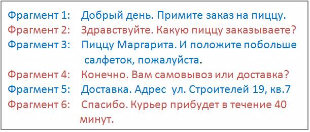

# 5.1. Термины и определения

> Трассировка: PDF §5.1 · сквозные стр. 81-83 · источники: ч.1 `kb/mango-product-docs/sources/speech-analytics/RECHEVAYA-ANALITIKA_c-KATS_v.1.26.18.pdf` с.81-83.

Канал - участник разговора, речь которого анализируется. Пользователь может выбрать один из трех каналов: • сотрудник • клиент • сотрудник и клиент Фрагмент разговора – непрерывная речь одного из участников разговора до момента вступления в разговор второго участника.

Терма – ключевое слово или словосочетание, которое необходимо найти в тексте записи разговора. Виды терм Простое слово. Например, слово окно. Речевая аналитика & КАТС | v.1.26.18 81

| 8 800 555 55 22, mango-office.ru |  |
| --- | --- |
|  | mango@mangotele.com |

Допустим, пользователь ищет это слово в речи клиента Вхождение засчитывается, когда слово окно (с учетом словоформ: окна, окон и т. д.) будет найдено в каком-то из фрагментов разговора клиента. Если слово окно будет найдено 5 раз в одном фрагменте или слово окно будет найдено в 5-ти разных фрагментах, то количество вхождений слова окно будет равно 5. Словосочетание Например, словосочетание купить окно. Допустим, пользователь ищет это словосочетание в речи клиента Вхождение засчитывается, когда одновременно слово купить и слово окно (с учетом словоформ) встретятся во фрагменте разговора клиента. Например, если клиент сказал Хочу купить ваше пластиковое окно, терма купить окно засчитается. Словосочетание в точном соответствии Например “купить окно” (отличается от обычной фразы ТОЛЬКО кавычками) Допустим, пользователь ищет в речи клиента словосочетание “купить окно”. Вхождение засчитается только в том случае, когда во фрагменте речи клиента встретится фраза купить окно (с учетом словоформ). Например, если клиент сказал Хочу купить ваше пластиковое окно, терма “купить окно” НЕ засчитается. А если клиент сказал Я очень хочу купить окна, терма “купить окно” засчитается. Слово или словосочетание без учета словоформ Например !окно (отличается от обычной фразы ТОЛЬКО символом «!») Допустим, пользователь ищет это слово в речи клиента Вхождение засчитывается, когда слово окно (без учета словоформ) будет найдено в каком-то из фрагментов разговора клиента. Например, если в каком-то из фрагментов разговора клиент скажет Я купил одно окно в этой организации. Чтобы закрепить все словоформы словосочетания, необходимо использовать символ «!» перед первым словом словосочетания - !купить окно. Вхождение засчитывается, если в каком-то из фрагментов разговора клиент скажет Я хочу купить одно окно в этой организации. Важно: Закрепить одно слово в словосочетании нельзя. Терма вида купить !окно является некорректной. Для поискового запроса !окно, найденные слова "окна", "окон" не засчитываются как вхождение. Слово или словосочетание в точном соответствии, без учета словоформ Речевая аналитика & КАТС | v.1.26.18 82

| 8 800 555 55 22, mango-office.ru |  |
| --- | --- |
|  | mango@mangotele.com |

«!купить окно» – используйте кавычки и символ ! для закрепления словоформы поискового запроса в точном соответствии. !«купить окно» – второй вариант для закрепления словоформы поискового запроса в точном соответствии. Вхождение засчитывается, если в каком-то из фрагментов разговора клиент скажет Я хочу купить окно с установкой. Вхождение - факт наличия термы во фрагменте разговора. У одной термы может быть сколько угодно вхождений, в зависимости от того, сколько раз она встречалась в разговоре.

|  | Фрагмент |  | Разговор | Канал | Вхождение / Терма |  |
| --- | --- | --- | --- | --- | --- | --- |
|  | разговора |  |  |  |  |  |
| Фрагмент1 |  |  | Примите заказ на пиццу | Клиент |  |  |
| Фрагмент 2 |  |  | Какую пиццу заказываете? | Сотрудник |  |  |
| Фрагмент 3 |  |  | Пиццу Маргарита и Четыре сезона | Клиент | Вхождение 1: терма Маргарита | Вхождение 2: терма Четыре сезона |
| Фрагмент 4 |  |  | Самовывоз или доставка? | Сотрудник |  |  |
| Фрагмент 5 |  |  | Сезоны с доставкой, Маргариту самовывоз | Клиент | Вхождение 3: терма Маргарита | Вхождение 4: терма Доставка |
| Фрагмент 6 |  |  | Сообщите адрес доставки | Сотрудник |  |  |
