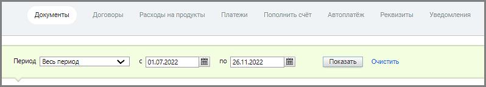

# 6.1.1. Просмотреть/загрузить бухгалтерские документы

> Трассировка: PDF §6.1.1 · сквозные стр. 86-87 · источники: ч.1 `kb/mango-product-docs/sources/speech-analytics/RECHEVAYA-ANALITIKA_c-KATS_v.1.26.18.pdf` с.86-87.

бухгалтерские документы Список «Период» позволяет установить вариант выбора дат (по умолчанию предлагается период «Произвольный»), нажав значок календаря, или ввести их в формате дд.мм.гггг в соответствующие поля. Кнопка «Очистить» возвращает к значению по умолчанию. Кликнув по кнопке «Показать», вы загрузите бухгалтерские документы за указанный календарный период. Нажмите на название любого из них, и появится стандартное диалоговое окно браузера, позволяющее открыть или сохранить файл. При наличии в инвойсах признака «Работать по УПД» (или «Формировать по форме УПД») в таблице отображаются Универсальные передаточные документы (УПД). Для получения более подробной информации об УПД щелкните ссылку «Что такое УПД и как с ним работать».

Речевая аналитика & КАТС | v.1.26.18 86

| 8 800 555 55 22, mango-office.ru |  |
| --- | --- |
|  | mango@mangotele.com |
