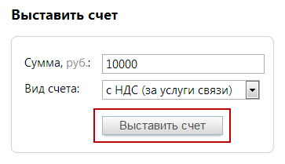

# 6.1.2. Сформировать счет на предоплату телекоммуникационных услуг

> Трассировка: PDF §6.1.2 · сквозные стр. 87 · источники: ч.1 `kb/mango-product-docs/sources/speech-analytics/RECHEVAYA-ANALITIKA_c-KATS_v.1.26.18.pdf` с.87.

телекоммуникационных услуг В блоке «Выставить счет» введите цифрами сумму платежа. Укажите тип формируемого счета (по умолчанию выбран первый вариант): • с НДС – за услуги связи, например, абонентский платеж за номер, черный/белый списки, дополнительные профили сотрудников, алгоритмы распределения разговоров, кнопку «Звонок с сайта» и т.п. Формируется счет с предметом «Предоплата за телекоммуникационные услуги» (например, за использование внешних линий); • без НДС – за использование ПО. Формируется счет с предметом «Ежемесячный фиксированный платеж за неисключительное право использования Программного продукта» (например, продукта ЛК). Нажмите кнопку «Выставить счет». Содержимое таблицы слева автоматически обновится. Чтобы просмотреть и при необходимости скачать нужный документ, кликните по любому из них. Появится стандартное диалоговое окно браузера, позволяющее открыть или сохранить файл.

