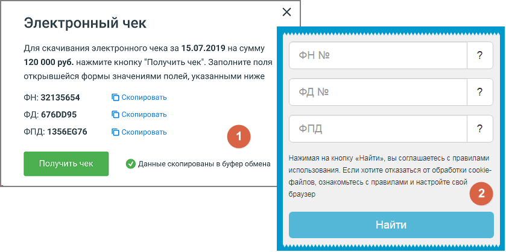

# 6.4. Платежи

> Трассировка: PDF §6.4 · сквозные стр. 93-94 · источники: ч.1 `kb/mango-product-docs/sources/speech-analytics/RECHEVAYA-ANALITIKA_c-KATS_v.1.26.18.pdf` с.93-94.

Список «Период» позволяет установить вариант выбора дат (по умолчанию предлагается период «Произвольный»), нажав значок календаря, или ввести их в формате дд.мм.гггг в соответствующие поля. Кнопка «Очистить» возвращает к значению по умолчанию.

Нажмите кнопку «Показать», и появится отчет о платежах, осуществленных в течение указанного периода. При наведении на строку, соответствующую конкретному платежу, отображается кнопка-ссылка «Электронный чек». Речевая аналитика & КАТС | v.1.26.18 93

| 8 800 555 55 22, mango-office.ru |  |
| --- | --- |
|  | mango@mangotele.com |

Клик по кнопке открывает форму 1 – Электронный чек, с данными ФН, ФД и ФПД. Клик по кнопке Получить чек открывает форму 2 в новой странице браузера. Скопируйте одноименные данные из формы-1 в форму-2 и нажмите Найти. Сохраните полученный электронный чек.
